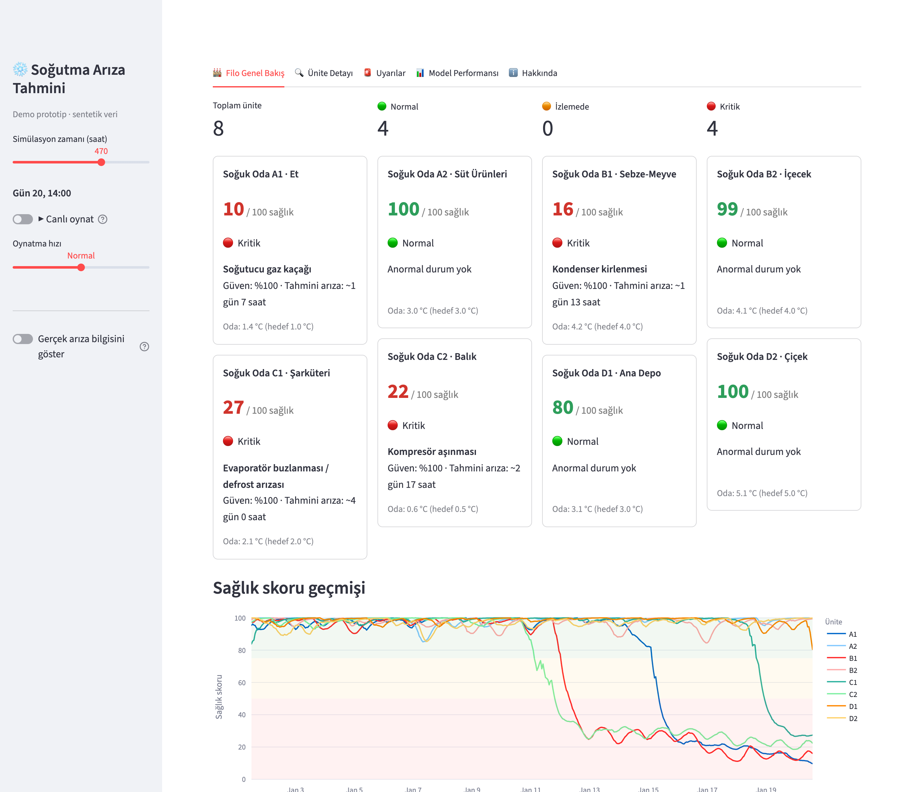
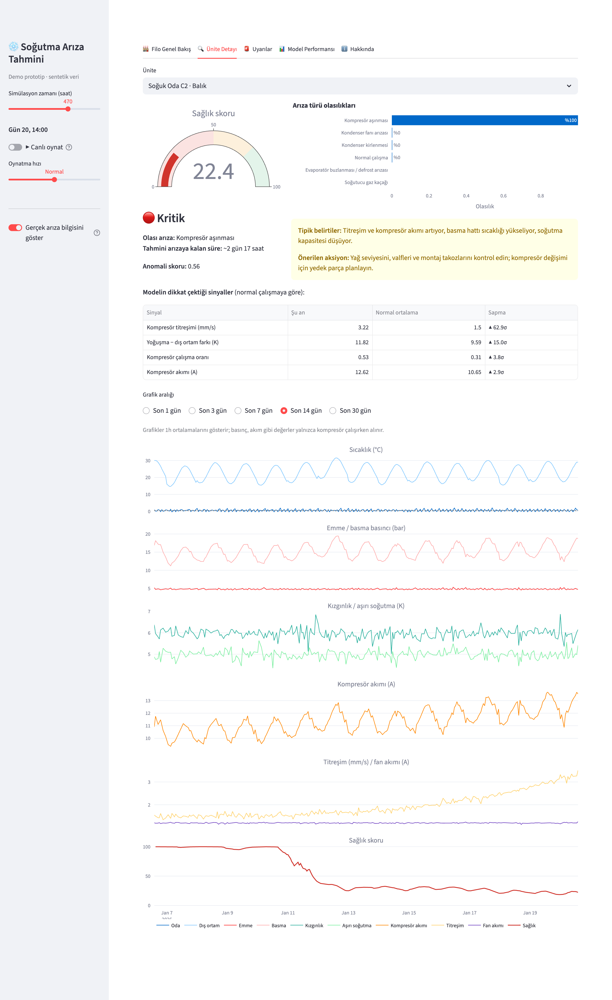
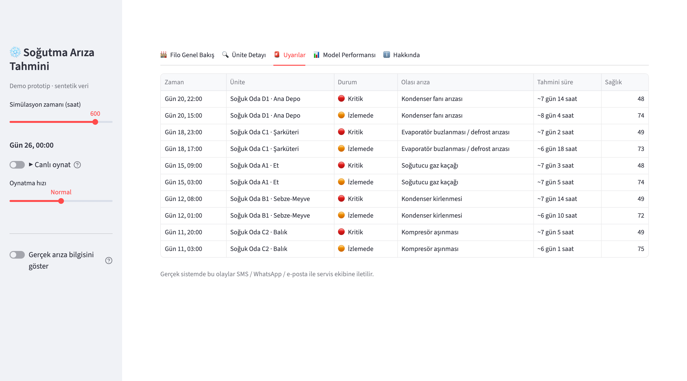
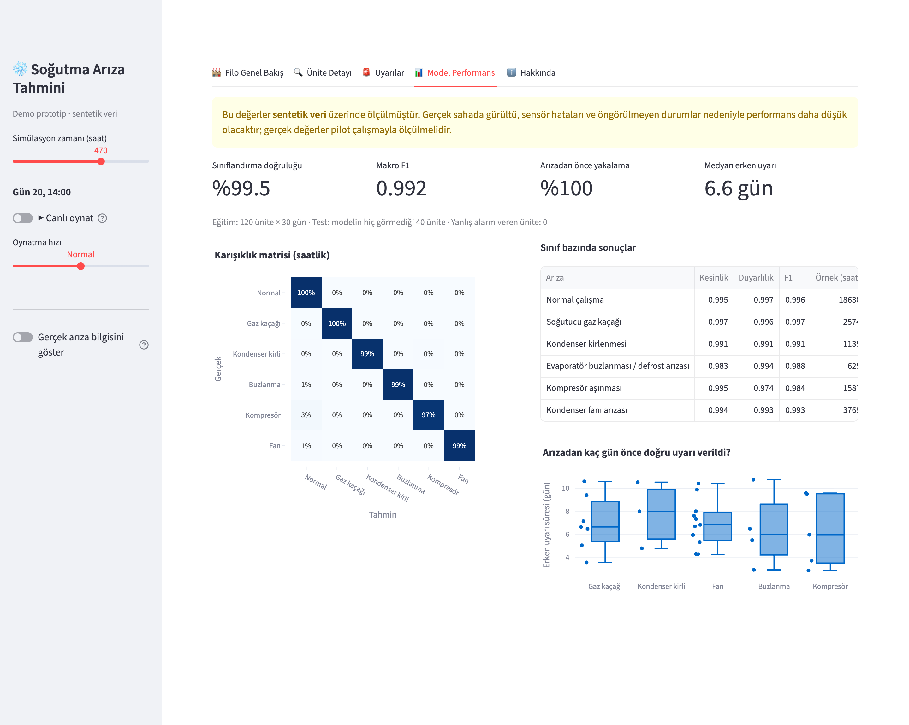
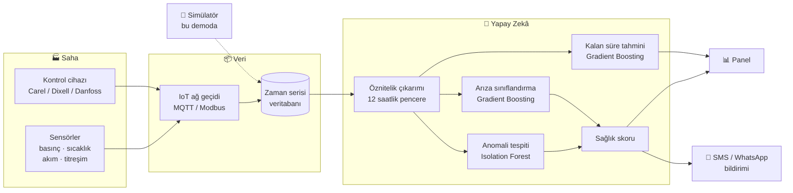

<div align="center">

# ❄️ Yapay Zekâ Destekli Soğutma Arıza Tahmini

**Soğuk odalardaki arızaları, ürün bozulmadan günler önce tahmin eden kestirimci bakım sistemi.**




</div>

---

## 🎯 Problem

Bir soğuk odanın arızalanması; bozulan ürün, acil servis ücreti ve müşteri kaybı demektir.
Oysa arızaların çoğu **aniden olmaz**: gaz kaçağı, kirlenen kondenser ya da aşınan kompresör,
günler öncesinden basınç, sıcaklık, akım ve titreşim verilerinde küçük izler bırakır.
Bu izler insan gözüyle fark edilemeyecek kadar küçüktür ama yapay zekâ onları yakalayabilir.

**Bu proje, soğutma sistemlerini 7/24 izleyen ve arızayı gerçekleşmeden önce servis ekibine
bildiren bir sistemin çalışan prototipidir.**

## ✨ Özellikler

- 🔍 **5 arıza türünü ayırt eder**: gaz kaçağı, kondenser kirlenmesi, evaporatör buzlanması, kompresör aşınması, kondenser fanı arızası
- ⏱️ **Arızaya kalan süreyi tahmin eder** (ör. *"~6 gün 9 saat"*)
- 💚 **0–100 sağlık skoru**: 🟢 Normal · 🟠 İzlemede · 🔴 Kritik
- 🧠 **Açıklanabilir tahmin**: Modelin hangi sinyale dikkat ettiğini ve normalden ne kadar saptığını gösterir
- 🛠️ **Bakım önerisi**: Her arıza için belirtiler ve yapılması gerekenler
- ▶️ **Canlı oynatma**: 30 günlük senaryoyu hızlandırarak izleme
- 🧪 **Fizik esaslı simülatör**: Gerçek veri olmadan model geliştirme ve test

## 📸 Ekran Görüntüleri

<table>
<tr>
<td width="50%"><b>Ünite detayı</b>: Kompresör aşınmasında titreşim ve akım yavaşça yükselir, model 15 gün önceden uyarır<br></td>
<td width="50%"><b>Uyarılar</b>: Servis ekibine gidecek bildirimler<br><br><br><b>Model performansı</b>: Hiç görülmemiş 40 ünite üzerinde test<br></td>
</tr>
</table>

## 🚀 Hızlı Başlangıç

```bash
git clone https://github.com/ml4yer/sogutma-ariza-tahmini.git
cd sogutma-ariza-tahmini
python3 -m venv .venv && source .venv/bin/activate
pip install -r requirements.txt
streamlit run app.py
```

İlk açılışta sentetik veri üretilir ve model eğitilir (yaklaşık 30 saniye). Sonra panel
`http://localhost:8501` adresinde açılır. Modeli elle yeniden eğitmek için: `python train.py`

> 💡 Paylaşılabilir bağlantı: `http://localhost:8501/?t=470` paneli 20. günden başlatır.

## 🏗️ Mimari



> Bu demoda saha katmanının yerini, fizik esaslı **simülatör** alır.

## ⚙️ Nasıl Çalışır?

### 1. Simülatör
Her soğuk oda 5 dakikalık adımlarla simüle edilir. Hesaba katılanlar: termostat kontrollü kompresör,
6 saatte bir defrost, gündüz yoğunlaşan kapı açılışları, günlük dış sıcaklık döngüsü ve R404A
doyma basınçları. Arızalar, zamanla hızlanarak ilerleyen bir **şiddet** değeri (0 → 1) olarak
eklenir. Şiddet 1'e ulaştığında oda artık sıcaklığı tutamaz; bu an **arıza anı** sayılır.

### 2. Öznitelikler
Ham veriden saatlik olarak türetilen 15 sinyal:

| Sinyal | Neyi gösterir? |
|---|---|
| Kızgınlık (superheat), aşırı soğutma (subcooling) | Gaz şarjı, genleşme valfi |
| Yoğuşma − dış ortam farkı | Kondenser ve fan verimi |
| Oda − evaporatör farkı | Evaporatör buzlanması, hava akışı |
| Kompresör akımı, titreşim, basma hattı sıcaklığı | Kompresörün mekanik durumu |
| Fan motor akımı | Rulman aşınması |
| Çalışma oranı, kalkış sayısı | Sistemin genel yükü |
| Defrost tepe sıcaklığı | Defrost rezistansının durumu |

### 3. Modeller

| Model | Görev | Neden? |
|---|---|---|
| **Isolation Forest** | Anomali tespiti | Sadece sağlıklı veriyle eğitilir; etiket gerektirmediği için sahada ilk günden çalışır |
| **Gradient Boosting (sınıflandırma)** | Arıza türü | Tablo verisinde güçlü ve hızlı |
| **Gradient Boosting (regresyon)** | Arızaya kalan süre | Bakım planlaması için |

Sağlık skoru, sınıflandırıcının "normal" olasılığı ile anomali skorunun ağırlıklı birleşimidir.

## 📊 Sonuçlar

Model 120 sanal ünitede eğitildi, **hiç görmediği 40 ünitede** test edildi:

| Metrik | Değer |
|---|---|
| Saatlik sınıflandırma doğruluğu | %99,5 |
| Makro F1 | 0,992 |
| Arızayı gerçekleşmeden önce yakalama | %100 |
| Medyan erken uyarı süresi | **6,6 gün** |
| Yanlış alarm veren sağlıklı ünite | 0 / 40 |

**Demo senaryoları:**

| Ünite | Arıza | İlk uyarı | Arıza anı | Erken uyarı |
|---|---|---|---|---|
| A1 · Et | Gaz kaçağı | 15. gün | 22. gün | ~7 gün |
| B1 · Sebze-Meyve | Kondenser kirlenmesi | 12. gün | 23. gün | ~11 gün |
| C1 · Şarküteri | Evaporatör buzlanması | 18. gün | 24. gün | ~5 gün |
| C2 · Balık | Kompresör aşınması | 11. gün | 26. gün | ~15 gün |
| D1 · Ana Depo | Kondenser fanı | 20. gün | 25. gün | ~4 gün |
| A2, B2, D2 | Sağlıklı | — | — | yanlış alarm yok ✅ |

> [!IMPORTANT]
> Bu değerler **sentetik veri** üzerinde ölçülmüştür. Gerçek sahada sensör gürültüsü, arızalı sensörler,
> aynı anda birden fazla arıza ve simülatörde modellenmeyen durumlar nedeniyle performans daha düşük
> olacaktır. Gerçek değerler ancak pilot çalışmayla ölçülebilir.

## 📁 Proje Yapısı

```
├── app.py                  # Streamlit izleme paneli
├── train.py                # Veri üretimi, eğitim, değerlendirme
├── sogutma/
│   ├── simulator.py        # Fizik esaslı soğuk oda simülatörü
│   ├── features.py         # Öznitelik çıkarımı
│   ├── model.py            # Anomali + sınıflandırma + kalan süre
│   └── faults.py           # Arıza türleri, belirtiler, bakım önerileri
└── docs/images/            # Ekran görüntüleri
```

## 🗺️ Yol Haritası

- [x] Fizik esaslı simülatör ve 5 arıza senaryosu
- [x] Anomali tespiti, arıza sınıflandırma, kalan süre tahmini
- [x] İzleme paneli, uyarılar, açıklanabilir tahminler
- [ ] Dondurucu (−18 °C), market dolabı ve chiller tipleri
- [ ] Pilot sahada sensör / IoT ağ geçidi kurulumu (MQTT, Modbus)
- [ ] Gerçek veri ve servis kayıtlarıyla modelin ince ayarı
- [ ] SMS / WhatsApp / e-posta bildirimleri
- [ ] Bulut dağıtımı ve çoklu müşteri desteği

---

<details>
<summary>🇬🇧 English summary</summary>

**AI-powered fault prediction for commercial refrigeration (cold rooms).** A working prototype
that detects and classifies five fault types (refrigerant leak, condenser fouling, evaporator icing,
compressor wear, condenser fan failure) and estimates time-to-failure, days before the unit
can no longer hold temperature.

Since no field data is available yet, a physics-inspired simulator generates sensor data (pressures,
temperatures, currents, vibration) with progressively degrading faults. Models: Isolation Forest
(anomaly detection), Gradient Boosting (fault classification and remaining-useful-life regression).
On 40 unseen simulated units, every fault was caught before failure, with a median lead time of 6.6 days
and no false alarms. These numbers are from synthetic data; real-world performance must be
validated in a pilot.

Run: `pip install -r requirements.txt && streamlit run app.py`
</details>

## 📄 Lisans

[MIT](LICENSE) © 2026 Ahmet Mirza Yıldıran
