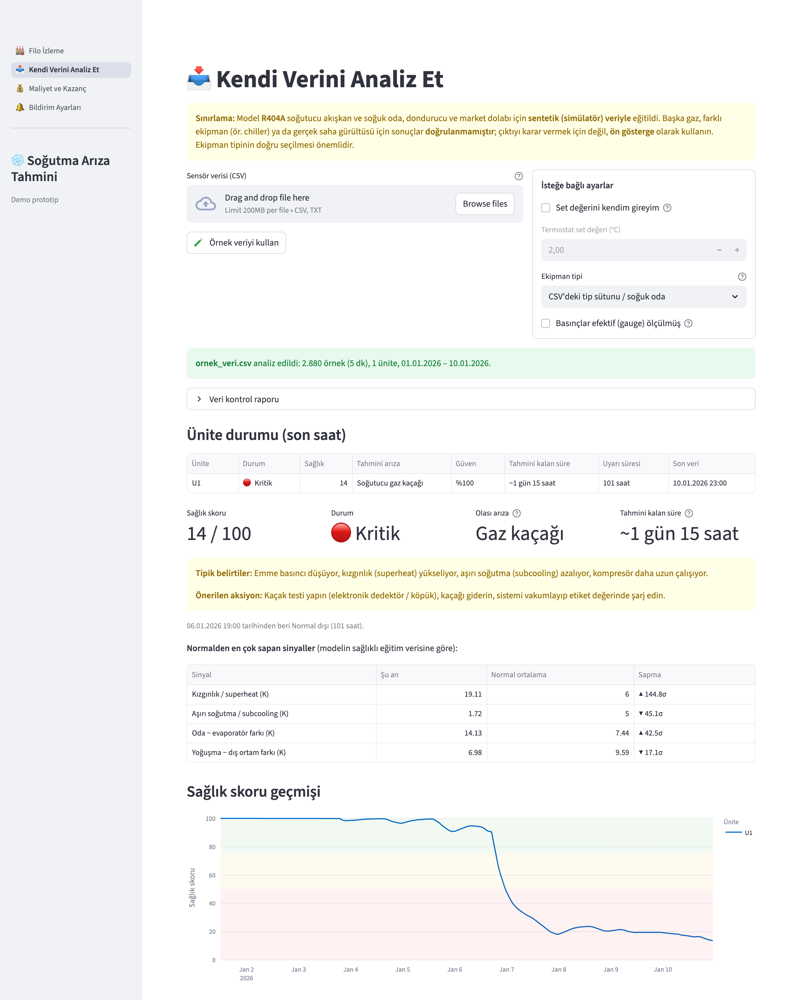
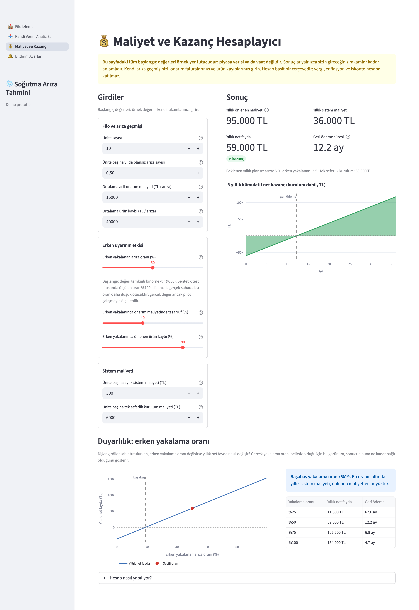
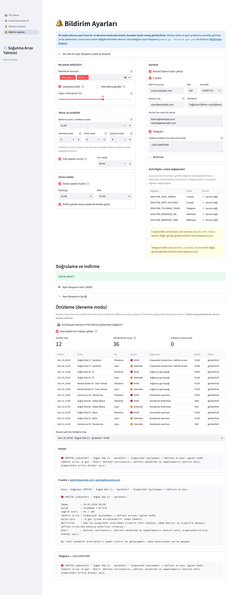
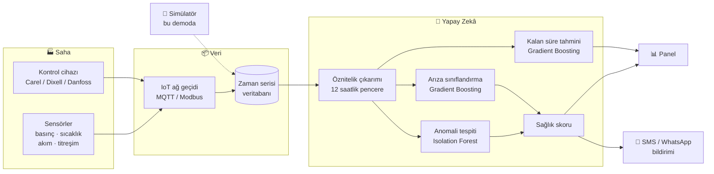

<div align="center">

# ❄️ Yapay Zekâ Destekli Soğutma Arıza Tahmini

**Soğuk oda, dondurucu ve market dolaplarındaki arızaları, ürün bozulmadan günler önce tahmin eden kestirimci bakım sistemi.**

[](https://github.com/mirzayildiran/sogutma-ariza-tahmini/actions/workflows/ci.yml)


</div>

---

## 🎯 Problem

Bir soğuk odanın arızalanması; bozulan ürün, acil servis ücreti ve müşteri kaybı demektir.
Oysa arızaların çoğu **aniden olmaz**: gaz kaçağı, kirlenen kondenser ya da aşınan kompresör,
günler öncesinden basınç, sıcaklık, akım ve titreşim verilerinde küçük izler bırakır.
Bu izler insan gözüyle fark edilemeyecek kadar küçüktür ama yapay zekâ onları yakalayabilir.

**Bu proje, soğutma sistemlerini 7/24 izleyen ve arızayı gerçekleşmeden önce servis ekibine
bildiren bir sistemin çalışan prototipidir.**

## ✨ Özellikler

- 🔍 **5 arıza türünü ayırt eder**: gaz kaçağı, kondenser kirlenmesi, evaporatör buzlanması, kompresör aşınması, kondenser fanı arızası
- 🧊 **3 ekipman tipi**: soğuk oda (≈0–5 °C), dondurucu oda (≈−20 °C) ve market dolabı; model hepsinde tek çatı altında çalışır
- ⏱️ **Arızaya kalan süreyi tahmin eder** (ör. *"~6 gün 9 saat"*)
- 💚 **0–100 sağlık skoru**: 🟢 Normal · 🟠 İzlemede · 🔴 Kritik
- 🧠 **Açıklanabilir tahmin**: Modelin hangi sinyale dikkat ettiğini ve normalden ne kadar saptığını gösterir
- 🛠️ **Bakım önerisi**: Her arıza için belirtiler ve yapılması gerekenler
- ▶️ **Canlı oynatma**: 30 günlük senaryoyu hızlandırarak izleme
- 📥 **Kendi verini analiz et**: Panelden sensör CSV'si yükle (ya da örnek veriyi kullan), ünite başına sağlık, olası arıza ve kalan süreyi gör, saatlik raporu indir
- 💰 **Maliyet ve kazanç (ROI) hesaplayıcı**: Kendi rakamlarınla yıllık önlenen maliyet, net fayda, geri ödeme süresi ve duyarlılık analizi
- 🔔 **Bildirim ayarları**: Panelden uyarı kurallarını (süreklilik, bekleme süresi, sessiz saatler) ve kanalları (e-posta, Telegram, webhook) ayarla, JSON olarak indir; demo filosunda mesajları **deneme modunda** önizle (panelden gerçek gönderim yapılmaz, parola/token panelde girilmez)
- 🧪 **Fizik esaslı simülatör**: Gerçek veri olmadan model geliştirme ve test

## 📸 Ekran Görüntüleri

<table>
<tr>
<td width="50%"><b>Ünite detayı</b>: Kompresör aşınmasında titreşim ve akım yavaşça yükselir, model 15 gün önceden uyarır<br></td>
<td width="50%"><b>Uyarılar</b>: Servis ekibine gidecek bildirimler<br><br><br><b>Model performansı</b>: Hiç görülmemiş sanal üniteler üzerinde test (sentetik veri)<br></td>
</tr>
<tr>
<td width="50%"><b>Kendi verini analiz et</b>: CSV yükle, veri kontrol raporunu, ünite durumunu ve sensör grafiklerini gör (örnek CSV üzerinde)<br></td>
<td width="50%"><b>Maliyet ve kazanç</b>: Kendi rakamlarını gir; görünen başlangıç değerleri yalnızca örnek yer tutucudur<br></td>
</tr>
<tr>
<td colspan="2"><b>Bildirim ayarları</b>: Kuralları ve kanalları (e-posta / Telegram / webhook) ayarla, JSON olarak indir; demo filosunda hangi mesajların gideceğini deneme modunda önizle (hiçbir şey gönderilmez)<br></td>
</tr>
</table>

## 🚀 Hızlı Başlangıç

```bash
git clone https://github.com/mirzayildiran/sogutma-ariza-tahmini.git
cd sogutma-ariza-tahmini
python3 -m venv .venv && source .venv/bin/activate
pip install -r requirements.txt
streamlit run app.py
```

İlk açılışta sentetik veri üretilir ve model eğitilir (yaklaşık 30 saniye). Sonra panel
`http://localhost:8501` adresinde açılır. Modeli elle yeniden eğitmek için: `python train.py`

> 💡 Paylaşılabilir bağlantı: `http://localhost:8501/?t=470` paneli 20. günden başlatır.

## 📥 Kendi Verinle Tahmin

Panelde **📥 Kendi Verini Analiz Et** sayfasından CSV yükleyebilir (ya da *Örnek veriyi kullan* düğmesine
basabilirsin). Panel olmadan, komut satırından da analiz edebilirsin:

```bash
python predict.py examples/ornek_veri.csv -o rapor.csv
python predict.py dondurucu.csv --tip dondurucu   # dondurucu / market_dolabi; varsayılan soguk_oda
```

Türkçe Excel çıktıları (`;` ayraç, virgüllü ondalık, Türkçe sütun adları) desteklenir; eksik isteğe bağlı
sensörlerde program çalışmaya devam eder. Sütunlar, birimler ve sınırlamalar için:
[Veri formatı](docs/veri-formati.md).

Saatlik çalışan bir cron işiyle birlikte **bildirim** de gönderebilir (e-posta, Telegram, webhook).
Varsayılan deneme modudur; `--gonder` verilmeden hiçbir mesaj gönderilmez:

```bash
python predict.py veri.csv --bildirim bildirim_ayarlari.json           # deneme modu
python predict.py veri.csv --bildirim bildirim_ayarlari.json --gonder  # gerçek gönderim
```

Ayrıntılar: [Bildirimler](docs/bildirimler.md).

## 🔌 API ve Docker

Aynı analiz akışı bir **REST API** olarak da sunulur (FastAPI): bir IoT ağ geçidi CSV ya da JSON ölçümlerini
gönderip ünite başına sağlık skoru, olası arıza ve kalan süreyi alabilir.

```bash
pip install -r requirements-api.txt && python train.py
uvicorn api:app --port 8000                                  # belgeler: http://localhost:8000/docs
curl -F dosya=@examples/ornek_veri.csv http://localhost:8000/tahmin/csv

docker compose up --build        # panel: http://localhost:8501, API: http://localhost:8000
```

Uç noktalar, kimlik doğrulama (`SOGUTMA_API_ANAHTARI`), hata kodları ve ağ geçidi örneği: [REST API ve Docker](docs/api.md).
Docker imajı oluşturulurken model eğitilir; imaj kendi kendine yeterlidir.

## 🏗️ Mimari



> Bu demoda saha katmanının yerini, fizik esaslı **simülatör** alır.

## ⚙️ Nasıl Çalışır?

### 1. Simülatör
Her ünite 5 dakikalık adımlarla simüle edilir. Hesaba katılanlar: termostat kontrollü kompresör,
periyodik defrost, kapı/müşteri erişimleri, günlük dış sıcaklık döngüsü ve R404A doyma basınçları.
Üç ekipman tipi vardır: **soğuk oda** (6 saatte bir 20 dk defrost), **dondurucu** (−20 °C civarı; evaporasyon
≈ −30 °C, yani ≈ 2 bar emme basıncı, sıkıştırma oranı ≈ 7, 8 saatte bir 30 dk elektrikli defrost) ve
**market dolabı** (mağaza saatlerinde yüksek ve değişken yük, gece perdesiyle düşük yük, dar termostat bandı). Arızalar, zamanla hızlanarak ilerleyen bir **şiddet** değeri (0 → 1) olarak
eklenir. Şiddet 1'e ulaştığında oda artık sıcaklığı tutamaz; bu an **arıza anı** sayılır.

### 2. Öznitelikler
Ham veriden saatlik olarak türetilen 15 sinyal ve 2 ekipman tipi bayrağı:

| Sinyal | Neyi gösterir? |
|---|---|
| Kızgınlık (superheat), aşırı soğutma (subcooling) | Gaz şarjı, genleşme valfi |
| Yoğuşma − dış ortam farkı | Kondenser ve fan verimi |
| Oda − evaporatör farkı | Evaporatör buzlanması, hava akışı |
| Kompresör akımı, titreşim, basma hattı sıcaklığı | Kompresörün mekanik durumu |
| Fan motor akımı | Rulman aşınması |
| Çalışma oranı, kalkış sayısı | Sistemin genel yükü |
| Defrost tepe sıcaklığı | Defrost rezistansının durumu |
| Ekipman tipi bayrakları | Soğuk oda / dondurucu / market dolabı ayrımı |

### 3. Modeller

| Model | Görev | Neden? |
|---|---|---|
| **Isolation Forest** | Anomali tespiti | Sadece sağlıklı veriyle eğitilir; etiket gerektirmediği için sahada ilk günden çalışır |
| **Gradient Boosting (sınıflandırma)** | Arıza türü | Tablo verisinde güçlü ve hızlı |
| **Gradient Boosting (regresyon)** | Arızaya kalan süre | Bakım planlaması için |

Sağlık skoru, sınıflandırıcının "normal" olasılığı ile anomali skorunun ağırlıklı birleşimidir.
Tipler arası karşılaştırma için modeller ham değer yerine, **ünitenin tipine ait sağlıklı ortalamadan sapmayı** görür
(dondurucunun normal emme basıncı ≈ 2 bar'dır; gaz kaçağı her tipte "normalden düşük basınç, yüksek kızgınlık" demektir).

## 📊 Sonuçlar

Model 120 sanal ünitede (60 soğuk oda, 30 dondurucu, 30 market dolabı) eğitildi, **hiç görmediği 60 ünitede** (30 / 15 / 15) test edildi:

| Metrik | Değer |
|---|---|
| Saatlik sınıflandırma doğruluğu | %99,4 |
| Makro F1 | 0,989 |
| Arızayı gerçekleşmeden önce yakalama | %100 (32 / 32) |
| Medyan erken uyarı süresi | **6,6 gün** |
| Yanlış alarm veren sağlıklı ünite | 0 / 60 |

Ekipman tipine göre (test filosunda tip başına 15–30 ünite olduğundan yalnızca yön göstericidir):

| Tip | Ünite | Saatlik doğruluk | Yakalama | Medyan erken uyarı | Yanlış alarm |
|---|---|---|---|---|---|
| Soğuk oda | 30 | %99,6 | 16 / 16 | 5,2 gün | 0 |
| Dondurucu | 15 | %99,3 | 8 / 8 | 7,3 gün | 0 |
| Market dolabı | 15 | %99,1 | 8 / 8 | 7,7 gün | 0 |

**Demo senaryoları** (12 ünite; "Gün N" panelin numaralamasıdır):

| Ünite | Arıza | İlk uyarı | Arıza anı | Erken uyarı |
|---|---|---|---|---|
| A1 · Et | Gaz kaçağı | 15. gün | 22. gün | ~7 gün |
| B1 · Sebze-Meyve | Kondenser kirlenmesi | 12. gün | 23. gün | ~11 gün |
| C1 · Şarküteri | Evaporatör buzlanması | 18. gün | 24. gün | ~5 gün |
| C2 · Balık | Kompresör aşınması | 11. gün | 26. gün | ~14 gün |
| D1 · Ana Depo | Kondenser fanı | 20. gün | 25. gün | ~4 gün |
| E2 · Dondurucu (Dondurma) | Kompresör aşınması | 11. gün | 24. gün | ~13 gün |
| F2 · Market Dolabı (Hazır Yemek) | Gaz kaçağı | 14. gün | 22. gün | ~8 gün |
| A2, B2, D2, E1, F1 | Sağlıklı | — | — | yanlış alarm yok ✅ |

> [!IMPORTANT]
> Bu değerler **sentetik veri** üzerinde ölçülmüştür. Gerçek sahada sensör gürültüsü, arızalı sensörler,
> aynı anda birden fazla arıza ve simülatörde modellenmeyen durumlar nedeniyle performans daha düşük
> olacaktır. Gerçek değerler ancak pilot çalışmayla ölçülebilir.

## 📚 Dokümantasyon

| Doküman | İçerik |
|---|---|
| [Model kartı](docs/model-karti.md) | Modelin amacı, verisi, metrikleri, sınırlamaları ve pilotta doğrulanması gerekenler |
| [Proje başvuru taslağı](docs/proje-dokumani.md) | Ar-Ge destek başvurusu için taslak: hedefler, iş paketleri, riskler, ticarileşme |
| [Veri formatı](docs/veri-formati.md) | Kendi CSV verini hazırlama: sütunlar, birimler, eksik sensörler |
| [Bildirimler](docs/bildirimler.md) | Uyarı kuralları, kanallar (e-posta / Telegram / webhook), ortam değişkenleri |
| [Saha mimarisi](docs/saha-mimarisi.md) | Gerçek sahaya geçiş: sensörler, IoT ağ geçidi, MQTT, veritabanı, güvenlik |

## 🧪 Testler

```bash
pip install -r requirements-dev.txt
pytest          # simülatör, öznitelik, model ve panel testleri (~10 sn, küçük bir filoyla eğitir)
ruff check .    # kod stili denetimi
```

## 📁 Proje Yapısı

```
├── app.py                  # Streamlit paneli (giriş noktası, sayfa gezinmesi)
├── sayfalar/               # Panel sayfaları
│   ├── filo.py             # Filo İzleme (demo filosu)
│   ├── analiz.py           # Kendi Verini Analiz Et (CSV yükleme)
│   ├── maliyet.py          # Maliyet ve Kazanç (ROI) hesaplayıcı
│   └── bildirim.py         # Bildirim Ayarları (kurallar, kanallar, deneme modu önizleme)
├── train.py                # Veri üretimi, eğitim, değerlendirme
├── predict.py              # Kendi CSV verinle toplu tahmin
├── api.py                  # REST API giriş noktası (uvicorn api:app); kod: sogutma/api.py
├── Dockerfile              # Tek imaj: API + panel
├── docker-compose.yml      # api (8000) ve panel (8501) servisleri
├── sogutma/
│   ├── simulator.py        # Fizik esaslı simülatör: soğuk oda, dondurucu, market dolabı
│   ├── features.py         # Öznitelik çıkarımı
│   ├── model.py            # Anomali + sınıflandırma + kalan süre
│   ├── ingest.py           # CSV okuma, doğrulama, 5 dk hizalama
│   ├── bildirim.py         # Uyarı kuralları ve bildirim kanalları
│   ├── analiz.py           # CSV → tahmin akışı (predict.py, panel ve API ortak kullanır)
│   ├── api.py              # FastAPI uygulaması (tahmin servisi)
│   ├── roi.py              # Maliyet / kazanç hesabı (saf fonksiyonlar)
│   ├── ui.py               # Panel ortak yardımcıları (yükleme, biçimlendirme, grafikler)
│   └── faults.py           # Arıza türleri, belirtiler, bakım önerileri
├── examples/               # Örnek CSV ve üretim betiği
├── tests/                  # pytest testleri
└── docs/                   # Dokümantasyon ve ekran görüntüleri
```

## 🗺️ Yol Haritası

- [x] Fizik esaslı simülatör ve 5 arıza senaryosu
- [x] Anomali tespiti, arıza sınıflandırma, kalan süre tahmini
- [x] İzleme paneli, uyarılar, açıklanabilir tahminler
- [x] Panel: CSV yükleyip kendi verisini analiz etme sayfası
- [x] Panel: maliyet ve kazanç (ROI) hesaplayıcı
- [x] Dondurucu (−18 °C) ve market dolabı tipleri
- [ ] Chiller tipi
- [ ] Pilot sahada sensör / IoT ağ geçidi kurulumu (MQTT, Modbus)
- [ ] Gerçek veri ve servis kayıtlarıyla modelin ince ayarı
- [ ] SMS / WhatsApp / e-posta bildirimleri
- [ ] Bulut dağıtımı ve çoklu müşteri desteği

---

<details>
<summary>🇬🇧 English summary</summary>

**AI-powered fault prediction for commercial refrigeration (cold rooms, freezer rooms and display cabinets).** A working prototype
that detects and classifies five fault types (refrigerant leak, condenser fouling, evaporator icing,
compressor wear, condenser fan failure) and estimates time-to-failure, days before the unit
can no longer hold temperature.

Since no field data is available yet, a physics-inspired simulator generates sensor data (pressures,
temperatures, currents, vibration) with progressively degrading faults. Models: Isolation Forest
(anomaly detection), Gradient Boosting (fault classification and remaining-useful-life regression).
On 60 unseen simulated units (mixed equipment types), every fault was caught before failure, with a median lead time of 6.6 days
and no false alarms. These numbers are from synthetic data; real-world performance must be
validated in a pilot.

Run: `pip install -r requirements.txt && streamlit run app.py`
</details>

## 📄 Lisans

[MIT](LICENSE) © 2026 Ahmet Mirza Yıldıran
