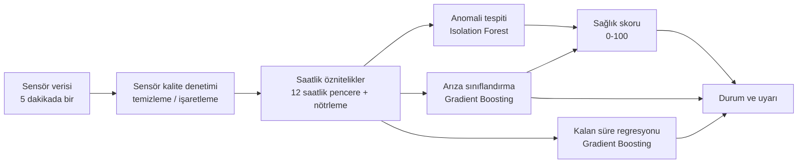

# Model Kartı — Soğutma Arıza Tahmini (Demo Prototip)

> **Durum:** Demo prototip. Model yalnızca **sentetik (simülatör) veri** ile eğitilmiş ve değerlendirilmiştir.
> Bu belgedeki başarım sayıları gerçek saha performansını **göstermez**; yalnızca yöntemin simülatör
> ortamında çalıştığının kanıtıdır. Gerçek performans pilot çalışmayla ölçülmelidir (bkz. [Pilotta doğrulanması gerekenler](#9-pilotta-doğrulanması-gerekenler)).

Sayısal sonuçlar, `python train.py` çalıştırılarak üretilen `models/metrics.json` dosyasından alınmıştır
(eğitim ve test verisi sabit rastgele tohumlarla üretildiği için sonuçlar yeniden üretilebilir).
Belgedeki kod ayrıntıları `train.py` ve `sogutma/` paketindeki kaynak koda dayanır.

## İçindekiler

1. [Genel bilgi](#1-genel-bilgi)
2. [Amaç ve kullanım alanı](#2-amaç-ve-kullanım-alanı)
3. [Veri: fizik esaslı simülatör](#3-veri-fizik-esaslı-simülatör)
4. [Öznitelikler](#4-öznitelikler)
5. [Modeller ve gerekçeleri](#5-modeller-ve-gerekçeleri)
6. [Sağlık skoru](#6-sağlık-skoru)
7. [Değerlendirme sonuçları](#7-değerlendirme-sonuçları)
8. [Sınırlılıklar ve riskler](#8-sınırlılıklar-ve-riskler)
9. [Pilotta doğrulanması gerekenler](#9-pilotta-doğrulanması-gerekenler)

---

## 1. Genel bilgi

| Alan | Değer |
|---|---|
| Ad | Soğutma Arıza Tahmini — kestirimci bakım modeli |
| Sürüm | Demo prototip |
| Görev | Soğuk oda, dondurucu oda ve market dolabı soğutma ünitelerinde arıza türü tespiti, arızaya kalan süre tahmini, 0–100 sağlık skoru |
| Girdi | Saatlik öznitelikler (5 dakikalık sensör verisinden, 12 saatlik kayan pencere ile) ve ünitenin ekipman tipi |
| Çıktı | Sağlık skoru, durum (Normal / İzlemede / Kritik), olası arıza türü, güven, tahmini arızaya kalan süre, anomali skoru |
| Kütüphane | scikit-learn (`IsolationForest`, `HistGradientBoostingClassifier`, `HistGradientBoostingRegressor`) |
| Kod | `sogutma/model.py`, `sogutma/features.py`, `sogutma/simulator.py`, `sogutma/veri_kalitesi.py`, `train.py` |
| Lisans | MIT (bkz. [LICENSE](../LICENSE)) |



Kalite denetimi sezgisel ve simülatör koşullarına göre ayarlıdır. Bu katman gerçek sahada sensör arızası tespit performansı
kanıtlamaz; saha kurulumunda eşikler gerçek sağlıklı veriye göre yeniden değerlendirilmelidir.

## 2. Amaç ve kullanım alanı

### Amaç

Soğuk oda, dondurucu oda ve market dolabı tipi soğutma sistemlerinde, ürün bozulmasına yol açan arızaları **gerçekleşmeden önce**
fark etmek ve servis ekibine arıza türü, aciliyet ve önerilen aksiyon bilgisiyle haber vermek.

### Hedeflenen kullanım

- Servis ve bakım planlamasına **karar destek** aracı olarak kullanım (hangi ünite, hangi arıza şüphesi, yaklaşık ne kadar süre var).
- Teknik ekibin ziyaret önceliklerini belirlemesi.
- Pilot saha çalışmalarında modelin gerçek veride davranışının incelenmesi (gölge modu).
- Arıza senaryolarının eğitim/gösterim amaçlı canlandırılması (Streamlit paneli).

### Kapsam dışı kullanımlar

- **Güvenlik fonksiyonu olarak kullanım:** Model; yüksek basınç şalteri, termik röle, alarm cihazları gibi koruma ekipmanlarının yerine geçmez. Soğutma sistemini otomatik olarak durdurmak/devreye almak için kullanılmamalıdır.
- **Resmî sıcaklık kaydı veya gıda güvenliği (ör. HACCP) kaydı** yerine kullanım.
- Gerçek veriyle doğrulanmadan **ticari taahhüt** (ör. "arızaların %X'ini yakalarız") verilmesi.
- Modelin eğitildiği koşulların dışındaki sistemlerde kullanım: chiller'lar, R404A dışı gazlar, çok kompresörlü/ kaskad sistemler, simülatörde bulunmayan ekipman tipleri (bkz. [Sınırlılıklar](#8-sınırlılıklar-ve-riskler)).
- Birden fazla arızanın aynı anda var olduğu veya arızanın sensör bozukluğundan kaynaklandığı durumlarda tek başına karar verme.

## 3. Veri: fizik esaslı simülatör

Gerçek saha verisi henüz yoktur. Veri, `sogutma/simulator.py` içindeki **basitleştirilmiş, fizik esaslı bir
simülatör** ile üretilir (üç ekipman tipi: soğuk oda, dondurucu oda, market dolabı). Simülatör termodinamik bir "dijital ikiz" değildir; arızaların
sensörlerde bıraktığı yönsel izleri (ör. gaz kaçağında emme basıncı düşer, kızgınlık artar) elle kurulmuş
denklemlerle taklit eder.

### Modellenen sistem

| Öğe | Simülatördeki karşılığı |
|---|---|
| Zaman adımı | 5 dakika; senaryo uzunluğu 30 gün |
| Soğutucu akışkan | R404A; doyma basıncı için yaklaşık Antoine tipi eğri: `ln p = 11,1093 − 2750,32 / (T + 294,261)` (bar, mutlak; T °C). Katsayılar yaklaşık R404A doyma değerlerine uydurulmuştur (−46 °C'de ≈1,0 bar, −30 °C'de ≈2 bar, 0 °C'de ≈5,8 bar, +40 °C'de ≈18 bar); `sat_temperature` bunun tam tersidir. Önceki üstel yaklaşım dondurucu evaporasyon sıcaklıklarında (−30 °C) basıncı yaklaşık %20 fazla veriyordu; soğuk oda aralığında yeni eğri eskisinden ±%5 içinde farklıdır |
| Termostat | Oda sıcaklığı `hedef + bant` üstüne çıkınca kompresör çalışır, `hedef − bant` altına inince durur (bant tipe göre: ±1 K; market dolabında ±0,5 K) |
| Defrost | Tipe göre (aşağıdaki tablo); defrostta kompresör durur, batarya ısıtılır ve odaya bir miktar ısı girer |
| Kapı / erişim olayları | Her adımda olasılıkla (ünite kapı trafiği katsayısı ile çarpılır); olasılıklar tipe göre (aşağıdaki tablo) |
| Dış ortam | 24 °C + ünite sapması + günlük rastgele sapma (σ = 2 K) + sinüs biçimli günlük döngü (±6 K) + ölçüm gürültüsü |
| Sensör gürültüsü | Gauss gürültüsü eklenir |
| Üretilen sinyaller | Dış ortam ve oda sıcaklığı, evaporatör batarya sıcaklığı, emme/basma basıncı, kızgınlık, aşırı soğutma, kompresör akımı, fan akımı, titreşim, basma hattı sıcaklığı, kompresör/defrost/kapı durumları |

### Ekipman tipleri

Tip parametreleri gerçek bir ekipman kataloğundan değil, **makul mertebelere göre elle seçilmiştir**; amaç
tipler arasındaki yönsel farkları (basınç düzeyi, sıkıştırma oranı, yük profili) taklit etmektir. Arızaların
sinyallere etkisi (aşağıdaki tablo) tüm tiplerde aynı mutlak büyüklüktedir.

| | Soğuk oda (`soguk_oda`) | Dondurucu (`dondurucu`) | Market dolabı (`market_dolabi`) |
|---|---|---|---|
| Hedef sıcaklık (rastgele filo) | 0 – 5 °C (varsayılan 2) | −22 – −18 °C (varsayılan −20) | 2 – 6 °C (varsayılan 4) |
| Termostat bandı | ±1 K | ±1 K | ±0,5 K (sık, kısa çevrim) |
| Defrost | 6 saatte bir, 20 dk | 8 saatte bir, 30 dk (elektrikli, güçlü ısıtıcı) | 6 saatte bir, 15 dk |
| Isı geçirgenliği (1/saat) | 0,06 | 0,034 (ΔT büyük olduğundan ısı kazancı hedefe göre yüksek) | gündüz 0,11, gece 0,045 (perde) |
| Yoğun saatler / kapı-erişim olasılığı (adım başına) | 07–19: %8, diğer: %1 | 07–19: %5, diğer: %1 | 08–22: %30, gece: 0; ek olarak yavaş değişen yük dalgalanması (σ ≈ %30) |
| Soğutma kapasitesi (K/saat) ve dış sıcaklık duyarlılığı | 4,0; −%1,2 / K | 3,8; −%1,8 / K | 6,0 (düşük ısıl kütle); −%1,0 / K |
| Oda − evaporasyon farkı | 8 K (evaporasyon ≈ −6 °C, ≈ 4,8 bar) | 9 K (≈ −29 °C, ≈ 2 bar) | 10 K (≈ −6 °C) |
| Sağlıklı kızgınlık / aşırı soğutma | 6 / 5 K | 8 / 5 K | 7 / 4 K |
| Yoğuşma − dış ortam; basma hattı − yoğuşma | 10 K; 25 K | 11 K; 38 K (sıkıştırma oranı ≈ 7, basma hattı ≈ 70 °C) | 12 K; 25 K |
| Kompresör akımı (sağlıklı, ortalama) | ≈ 10,7 A | ≈ 12 A | ≈ 6,4 A (küçük kapasite) |

Bu parametrelerle sağlıklı ünitelerde kompresör çalışma oranı soğuk odada ≈ %32, dondurucuda ≈ %42,
market dolabında gündüz ≈ %37 / gece ≈ %12'dir (5 günlük örnek çalıştırmalar). Soğuk oda için
önceki davranış korunmuştur: oda sıcaklığı, defrost, kapı ve arıza dinamikleri aynı rastgele akışla birebir aynıdır;
yalnızca basınç türevi sinyaller yeni doyma eğrisi nedeniyle birkaç yüzde farklıdır.

Kompresör durduğunda basınç, kızgınlık, aşırı soğutma ve akım gibi sinyaller anlamsızdır; öznitelik
çıkarımında bu sinyaller yalnızca kompresör çalışırken (ve defrostta değilken) kullanılır.

### Arıza türleri

Beş arıza türü modellenmiştir; her ünitede **tek bir arıza** vardır veya hiç yoktur.

| Anahtar | Arıza | Simülatörde etki edilen sinyaller (şiddet arttıkça) |
|---|---|---|
| `gaz_kacagi` | Soğutucu gaz kaçağı | Soğutma kapasitesi düşer; emme basıncı düşer; kızgınlık yükselir; aşırı soğutma azalır; kompresör akımı biraz düşer; basma hattı sıcaklığı yükselir |
| `kondenser_kirlenmesi` | Kondenser kirlenmesi | Yoğuşma sıcaklığı (dolayısıyla basma basıncı ve kompresör akımı) artar; kapasite düşer |
| `evaporator_buzlanma` | Evaporatör buzlanması / defrost arızası | Evaporasyon sıcaklığı ve kızgınlık düşer; kapasite düşer; defrostta batarya yeterince ısınmaz |
| `kompresor_asinmasi` | Kompresör aşınması | Titreşim (şiddetin karesiyle) ve kompresör akımı artar; basma hattı sıcaklığı yükselir; kapasite düşer |
| `fan_arizasi` | Kondenser fanı arızası | Fan motor akımı ve yoğuşma sıcaklığı artar; kapasite düşer |

### Sensör arızaları (isteğe bağlı)

Ekipman arızasından **bağımsız** olarak, bir ünitenin tek bir sensörüne ölçüm arızası enjekte edilebilir
(`Unit.sensor_faults`, `SensorFault`). Fiziksel süreç etkilenmez, yalnızca o sensörün okuması bozulur; varsayılan
(arızasız) simülasyon eskisiyle bit düzeyinde aynıdır (ayrı rastgele akış kullanılır). Altı tür vardır:

| Tür | Etki |
|---|---|
| `kayma` | Okuma, başlangıçtan itibaren doğrusal artan bir ofset kazanır (varsayılan: sensöre göre günde ≈ 0,1–1 birim; ör. oda sıcaklığı 0,5 K/gün, emme basıncı 0,08 bar/gün) |
| `takili` | Okuma, arıza öncesi son değerde donar |
| `kopuk` | Sabit ve anlamsız değer: sıcaklıklarda −50 °C, basınç/akım/titreşimde 0 |
| `veri_kaybi` | Farklı uzunlukta (varsayılan 0,5–6 saat) NaN boşlukları; varsayılan olarak sürenin ≈ %25'i kayıp |
| `ani_sicrama` | Örneklerin ≈ %2'sinde tek örneklik büyük sıçramalar (±) |
| `gurultu` | Arıza süresince sensörün normal gürültüsünün birkaç katı gürültü |

Şiddetler sensör başına elle seçilmiş mertebelerdir (`simulator._SENSOR_PROFIL`); gerçek sensör arıza istatistiklerine
dayanmaz. Sensör arızasının kontrol cihazını etkilemesi (ör. bozuk probun termostatı yanlış yönlendirmesi) modellenmemiştir.

### Şiddet eğrisi ve arıza anı

Her arıza, `fault_start_h` anında başlar ve `fault_duration_h` süresince ilerleyen bir **şiddet** (0 → 1)
değeri taşır:

```
x      = (t − arıza_başlangıcı) / arıza_süresi      (0 ile 1 arasına kırpılır)
şiddet = x ^ 1.6
```

Bozulma başta yavaştır, sona doğru hızlanır. (Kondenser fanı arızasında fanın etkileri `şiddet^1.5`
ile ölçeklenir.) Şiddet 1'e ulaştığında ünite artık sıcaklığı tutamaz; bu an **arıza anı** kabul edilir.
`hours_to_failure` etiketi, arıza anına kalan saattir.

### Etiketleme

Bir saat, o saatteki en yüksek şiddet **≥ 0,1** ise arıza türü etiketini alır; aksi halde `normal`
etiketi verilir (`hourly_features`, `label_threshold=0.1`). Şiddet `x^1.6` olduğundan eşik, arıza süresinin
yaklaşık ilk %24'ü geçildiğinde aşılır. Yani arızalı ünitelerin erken dönem (şiddet < 0,1) saatleri
`normal` olarak etiketlenir. "Gerçek" etiketler simülatörün tanımıdır; gerçek sahada bu etiketler servis
kayıtlarından türetilecektir ve çok daha belirsiz olacaktır.

### Eğitim ve test filoları

| | Eğitim | Test |
|---|---|---|
| Ünite sayısı | 120 | 60 |
| Süre | 30 gün | 30 gün |
| Rastgele tohum | 1 | 2 |
| Arıza oranı | Üniteleri %75 olasılıkla arızalı (`fault_ratio=0.75`) | Aynı süreç |
| Test filosunun gerçekleşen bileşimi | — | 18 sağlıklı + 42 arızalı ünite (gaz kaçağı 12, kondenser 4, buzlanma 8, kompresör 6, fan 12); 42 arızalı ünitenin 32'sinde arıza anı 30 günlük pencerenin içindedir |

Rastgele filoda ekipman tipi dağılımı sabittir: **%50 soğuk oda, %25 dondurucu, %25 market dolabı** (eğitimde 60 / 30 / 30,
testte 30 / 15 / 15 ünite); her tipte beş arıza türünün hepsi mümkündür ve arıza türü tipten bağımsız seçilir (tip etiketi
arıza türünü sızdırmaz). Tip ataması ayrı bir rastgele üreteçten yapıldığı için yalnızca soğuk odalı bir filo
önceki filoyla birebir aynı üretilir. Ünite parametreleri: hedef sıcaklık tipin aralığında (yukarıdaki tablo), kapasite 0,9–1,15, dış ortam sapması
N(0, 3 K), kapı trafiği 0,5–1,6; arıza süresi 4–14 gün; arıza başlangıcı 3. günden itibaren
(`3·24` saat ile `gün·24 − 0,5·süre` saat arasında düzgün dağılım). Test filosu, eğitimde hiç kullanılmayan
farklı **üniteler**dir; ancak aynı simülatörden ve aynı parametre dağılımından üretilmiştir.

Her ünitenin ilk 12 saati (ısınma/pencere dolumu) öznitelik tablosundan çıkarılır.

## 4. Öznitelikler

Modele giren 17 öznitelik (`sogutma/features.py`): 15 fiziksel sinyal ve 2 ekipman tipi bayrağı. Ham 5 dakikalık veri önce **saatlik** olarak
toplanır, sonra **12 saatlik kayan ortalama** (`WINDOW_H = 12`, `min_periods=2`) ile yumuşatılır.
Kompresör durduğu (veya defrosttaki) anlarda anlamsız olan sinyaller yalnızca kompresör
çalışırken hesaba katılır.

| Öznitelik | Anlamı | Hesaplama |
|---|---|---|
| `p_suc` | Emme basıncı (bar) | Çalışma anlarının ortalaması |
| `p_dis` | Basma basıncı (bar) | Çalışma anlarının ortalaması |
| `sh` | Kızgınlık / superheat (K) | Çalışma anlarının ortalaması |
| `sc` | Aşırı soğutma / subcooling (K) | Çalışma anlarının ortalaması |
| `i_comp` | Kompresör akımı (A) | Çalışma anlarının ortalaması |
| `i_fan` | Kondenser fan akımı (A) | Çalışma anlarının ortalaması |
| `vib` | Kompresör titreşimi (mm/s) | Çalışma anlarının ortalaması |
| `t_dis` | Basma hattı sıcaklığı (°C) | Çalışma anlarının ortalaması |
| `cond_approach` | Yoğuşma − dış ortam farkı (K) | `T_sat(p_dis) − t_amb`; çalışma anlarında |
| `evap_delta` | Oda − evaporatör farkı (K) | `t_room − T_sat(p_suc)`; çalışma anlarında |
| `duty` | Kompresör çalışma oranı | Saatte kompresörün çalıştığı (defrost dışı) zaman oranı |
| `starts` | Saatlik kompresör kalkışı | Saatteki kalkış sayısı |
| `t_room_dev` | Oda sıcaklığı sapması (K) | `t_room − hedef sıcaklık` |
| `coil_defrost_peak` | Defrostta batarya tepe sıcaklığı (°C) | Defrost anlarındaki en yüksek batarya sıcaklığı; son 12 saatin maksimumu (defrost 6 saatte bir olduğundan pencerede en az bir defrost bulunur) |
| `t_amb` | Dış ortam sıcaklığı (°C) | Saatlik ortalama |
| `tip_dondurucu`, `tip_market` | Ekipman tipi bayrakları (0/1) | Ünitenin sabit özelliği; ikisi de 0 ise soğuk oda. Arıza etiketinden türetilmez |

Notlar:

- `T_sat(p)`, simülatördeki R404A yaklaşık eğrisinin tersidir; başka gazlar için değiştirilmelidir.
- Eksik saatler (ör. hiç çalışmama) önceki/sonraki değerle doldurulur (`ffill`/`bfill`).
- Kapı açılış bilgisi simülatörde üretilir ancak **modele öznitelik olarak verilmez**.
- Öznitelik tablosunda ayrıca `tip` (metin) sütunu bulunur; model bunun yerine bayrakları kullanır. Tip bilgisi ham veride `tip` sütunundan gelir; yoksa soğuk oda varsayılır (`predict.py --tip`).
- `t_room_dev`, `duty` ve `starts` gibi göreli öznitelikler tipler arasında doğrudan kıyaslanabilir; mutlak değerli olanlar (`p_suc`, `p_dis`, `t_dis`, `i_comp`...) tipe göre çok farklı seviyelerdedir (ör. dondurucuda normal emme basıncı ≈ 2 bar, soğuk odada ≈ 5 bar) ve bu nedenle modele tip referansından sapma olarak verilir (bkz. aşağıda).
- Öznitelikler 12 saatlik pencerenin ortalaması olduğundan model ani olayları değil, **saatler-günler mertebesinde ilerleyen** bozulmaları yakalar.

## 5. Modeller ve gerekçeleri

| Model | Görev | Yapılandırma | Eğitim verisi | Neden? |
|---|---|---|---|---|
| **Isolation Forest** | Anomali tespiti | 300 ağaç, `random_state=0`; girdi `StandardScaler` ile ölçeklenir | Yalnızca şiddeti 0 olan saatler | Arıza etiketi gerektirmez; gerçek sahada ilk günden çalışabilir ve eğitilmemiş arıza türlerine karşı da bir güvenlik ağı sağlar |
| **HistGradientBoostingClassifier** | Arıza türü (6 sınıf: normal + 5 arıza; tüm tiplerde tek model) | `max_iter=200`, `learning_rate=0.05`, `max_leaf_nodes=15`, `min_samples_leaf=80`, `l2_regularization=1.0`, `random_state=0` | Tüm eğitim saatleri | Tablo verisinde güçlü ve hızlıdır; olasılık çıktısı verir; küçük veriyle iyi çalışır |
| **HistGradientBoostingRegressor** | Arızaya kalan süre (saat) | `max_iter=300`, `random_state=0`; hedef `log1p(min(süre, 336 saat))` | Arıza etiketli ve arıza anına kalan süresi > 0 olan saatler | Bakım planlaması için tahmini süre; log ölçeği yakın arızalarda göreli doğruluğu öne çıkarır |

Ek ayrıntılar:

- **Tipe göre göreli girdi:** Her model (Isolation Forest, sınıflandırıcı, regresör) ham öznitelikleri değil, her özniteliğin
  **ünitenin tipine ait sağlıklı eğitim ortalamasından sapmasını** (artı tip bayraklarını) girdi alır. Böylece "gaz kaçağı =
  emme basıncı normalden düşük, kızgınlık normalden yüksek" kalıbı üç tipte de paylaşılır. Eğitimde görülmeyen bir tip için genel
  sağlıklı ortalama kullanılır. Eksik sensörler tip ortalamasıyla doldurulur (sapma 0 = nötr). Bu, simülatörde arıza etkilerinin tüm
  tiplerde aynı **mutlak** büyüklükte kurulmasına dayanır; gerçek ekipmanlarda etkiler tipe göre farklı ölçeklenebilir.
- **Tasarım notu (sonuçlar):** İlk denemede yalnızca ham öznitelikler + tip bayrakları kullanıldığında, 120 üniteli eğitimde market
  dolabı saatlik doğruluğu ≈ %92,8'e düştü (kompresör aşınması kondenser kirlenmesiyle karıştı; tip başına az sayıda örnek). Aynı
  yapıyla eğitim filosu 300 üniteye çıkarılınca ≈ %99,3 oldu; tipe göre göreli girdiyle ise 120 ünitede de ≈ %99,3. Sorun
  yöntemden çok tip başına örnek azlığıydı ve göreli girdi bunu giderdi. Bu karşılaştırma çoklu test tohumuyla yapılmış bir geliştirme
  incelemesidir (`train.py` çıktısı değildir).
- Ham anomali skoru, sağlıklı eğitim verisinin dağılımına göre normalleştirilir:
  `anomali = clip((s50 − s) / (s50 − s1) / 2, 0, 1)`; burada `s` Isolation Forest skoru, `s50` ve `s1`
  sağlıklı verideki skorun medyanı ve %1'lik dilimidir. Sağlıklı medyan seviyesinde skor 0, sağlıklı verinin
  %1'lik kuyruğunda yaklaşık 0,5 olur.
- Kalan süre tahmini en fazla 14 günlük (336 saat) ufukla sınırlıdır ve yalnızca durum "Normal" değilken gösterilir.
- Hiperparametreler elle seçilmiştir; ayrı bir doğrulama kümesiyle ayarlanmamıştır.
- `FaultPredictor.explain` açıklama sağlar: **aynı tipteki** sağlıklı verinin ortalama ve standart sapmasına göre z-skoru
  hesaplar, mutlak değeri ≥ 2 olan en çok sapan en fazla 4 sinyali listeler (`t_amb` hariç). Bu, modelin
  iç işleyişinin tam açıklaması değil, **sağlıklı davranıştan sapmanın** özetidir.

### Sensör sağlığı katmanı (model dışı ön işleme)

Sensör arızası model tarafından ekipman arızası sanılmasın diye, öznitelik çıkarımından önce ham veri
`sogutma/veri_kalitesi.py` ile taranır (modelin kendisi ve `MODEL_VERSION` değişmemiştir; katman eğitim etiketi kullanmaz):

1. **Kontroller (5 dakikalık ham veri, ünite başına):** aralık dışı değer, takılı (ardışık 1–2 saat boyunca değişmeyen okuma;
   yalnızca kompresör çalışırken okunan sensörlerde 12 geçerli örnek), kopuk (sabit anlamsız değer, çalışırken 0 A), veri kaybı
   (saatin yarısından fazlası eksik), ani sıçrama (yerel medyandan sapma), gürültü, ve **sensörler arası fiziksel ilişkiler**:
   çalışırken batarya sıcaklığı ≈ doyma sıcaklığı(emme) + 1 K; uzun duruşta doyma sıcaklığı(emme) ≈ oda ≈ batarya, doyma
   sıcaklığı(basma) ≈ dış ortam + 2 K ve basma hattı ≈ dış ortam; dururken akım/titreşim ≈ 0; çalışırken emme < basma. İlişki
   sapmasının 12 saatlik medyanı eşiği (1 K) aşarsa, sapan çiftlerin ortak sensörü "tutarsız (kayma şüphesi)" sayılır; tek çift
   sapıyorsa iki sensör de şüphelidir.
2. **Çıktı:** (ünite, saat, sensör) bazında neden kodu (`takili`, `kopuk`, `veri_kaybi`, `tutarsiz`, `gurultu`, `ani_sicrama`,
   `aralik_disi`) ve "Sensör şüphesi: Emme basıncı takılı" gibi metin. Bu bir **sensör arızası** teşhisidir; ekipman arızası
   olasılığından ayrı bir kanaldır ve sağlık skorunu/durumu doğrudan değiştirmez.
3. **Model entegrasyonu:** Ani sıçrama ve aralık dışı örnekler silinir (NaN). Takılı, kopuk, veri kaybı, tutarsız ve gürültülü
   sensörlerin öznitelikleri (`SENSOR_OZNITELIK`; ör. emme basıncı → `p_suc`, `evap_delta`) son 12 saat (öznitelik penceresi)
   boyunca NaN yapılır; `FaultPredictor` NaN'ı tip referansıyla doldurur, yani o sinyal ne arıza ne sağlık kanıtı olur. Diğer
   sensörlerin özniteliği olduğu gibi kalır, bu yüzden sensörü bozuk ünitede de gerçek bir ekipman arızası kalan sinyallerden
   yakalanabilir (bkz. değerlendirme).

**Eşikler sezgiseldir:** fiziksel mantık ve sağlıklı simülasyondaki dağılım üzerinden elle seçilmiştir. İlişki kontrolleri
simülatörün kurulumuna (ör. batarya sıcaklığının evaporasyon sıcaklığını izlemesi, duruşta basınç dengelenmesi) dayanır; gerçek
sahada ilişkilerin merkezi ve toleransı farklı olacaktır, eşiklerin gerçek sağlıklı veriyle yeniden kalibre edilmesi gerekir.

## 6. Sağlık skoru

Her saat için:

```
ham_sağlık = 100 × ( 0.6 × P(normal) + 0.4 × (1 − anomali) )
sağlık     = ham_sağlık'ın ünite bazında üstel ağırlıklı ortalaması (EWM, span = 12 saat), 1 ondalığa yuvarlanır
```

`P(normal)` sınıflandırıcının "normal" olasılığı, `anomali` yukarıda tanımlanan 0–1 aralığındaki skordur.

| Sağlık skoru | Durum |
|---|---|
| ≥ 75 | 🟢 Normal |
| 50 – 75 | 🟠 İzlemede |
| < 50 | 🔴 Kritik |

Davranış üzerine notlar:

- Durum "Normal" ise gösterilen arıza türü `normal` olur; "Normal" değilse, arıza olasılıkları arasında (normal hariç) en yüksek olan tür gösterilir. Güven değeri o türün olasılığıdır.
- Ağırlıklar (0,6 / 0,4) ve eşikler (75 / 50) kodda sabit değerlerdir; veriden kalibre edilmemiştir.
- Ağırlıklar nedeniyle yalnızca anomali skoru yüksek, sınıflandırıcı ise "normal" diyorsa ham sağlık en düşük **60** olur (İzlemede); yalnızca sınıflandırıcı arıza diyor, anomali skoru 0 ise **40** olur (Kritik). Yani anomali tek başına "Kritik" üretemez; Kritik için sınıflandırıcının arıza olasılığı gerekir.
- EWM yumuşatma, anlık gürültüye bağlı dalgalanmayı azaltır, ancak durum değişiminde birkaç saatlik gecikme yaratır.

## 7. Değerlendirme sonuçları

**Yöntem:** Model, 120 üniteli eğitim filosunda eğitildi; **eğitimde hiç görülmeyen** 60 üniteli test
filosunda (tohum 2; 30 soğuk oda, 15 dondurucu, 15 market dolabı) değerlendirildi (42 480 ünite-saat). Sınıflandırma metrikleri saatlik örnekler üzerindedir
ve `FaultPredictor.classify` (sınıflandırıcının ham kararı) çıktısıyla hesaplanır; erken uyarı metrikleri ise tam hat
(sağlık skoru → durum → arıza türü) üzerinden hesaplanır. Kaynak: `models/metrics.json` (genel ve `per_tip` alanı).

> ⚠️ **Tüm sayılar sentetik veri üzerindedir.** Test filosu, eğitimle aynı simülatörden ve aynı parametre
> dağılımından üretildiği için dağılım kayması yoktur; bu nedenle sonuçlar gerçek sahadaki beklentiyi
> **olduğundan çok iyimser** gösterir.

### Genel sınıflandırma (saatlik)

| Metrik | Değer |
|---|---|
| Doğruluk (accuracy) | 0,9941 (%99,4) |
| Makro F1 | 0,9886 |
| Hatalı sınıflanan saat | 250 / 42 480 |

Sınıflandırıcının verdiği ham sınıf olasılıkları için ek proper-scoring ölçümleri: çok sınıflı Brier skoru **0,0100**, log-loss
**0,0223** (42 480 saat). Bunlar olasılıkların kalibre edildiğini göstermez; kalibrasyon uygulanmamıştır. “Güven” alanı
bu nedenle doğruluk olasılığı olarak yorumlanmamalıdır.

### Sınıf bazında sonuçlar

| Sınıf | Kesinlik (precision) | Duyarlılık (recall) | F1 | Örnek (saat) |
|---|---|---|---|---|
| Normal | 0,995 | 0,997 | 0,996 | 29 611 |
| Gaz kaçağı | 0,997 | 0,994 | 0,996 | 3 872 |
| Kondenser kirlenmesi | 0,982 | 0,994 | 0,988 | 1 296 |
| Evaporatör buzlanması | 0,988 | 0,996 | 0,992 | 2 055 |
| Kompresör aşınması | 0,991 | 0,942 | 0,966 | 1 781 |
| Kondenser fanı arızası | 0,992 | 0,997 | 0,994 | 3 865 |

### Karışıklık matrisi (satır: gerçek, sütun: tahmin; saat sayısı)

| Gerçek \ Tahmin | Normal | Gaz kaçağı | Kondenser | Buzlanma | Kompresör | Fan |
|---|---|---|---|---|---|---|
| **Normal** | 29 515 | 12 | 20 | 25 | 7 | 32 |
| **Gaz kaçağı** | 22 | 3 850 | 0 | 0 | 0 | 0 |
| **Kondenser** | 0 | 0 | 1 288 | 0 | 8 | 0 |
| **Buzlanma** | 9 | 0 | 0 | 2 046 | 0 | 0 |
| **Kompresör** | 99 | 0 | 4 | 0 | 1 678 | 0 |
| **Fan** | 12 | 0 | 0 | 0 | 0 | 3 853 |

250 hatanın 238'i normal sınıfıyla karışıklıktan (arıza saatinin "normal" sayılması veya tersi) gelir;
arıza türleri arasındaki karışıklık yalnızca 12 saattir (kondenser kirlenmesi ↔ kompresör aşınması). Doğruluk, çoğunluk sınıfı
(normal, saatlerin yaklaşık %70'i) tarafından yukarı çekildiği için tek başına yanıltıcı olabilir; sınıf
bazında değerlere ve erken uyarı metriklerine birlikte bakılmalıdır. En zayıf sınıf kompresör aşınmasıdır: erken
dönem saatlerinin bir kısmı "normal" olarak sınıflanır.

### Erken uyarı (ünite bazında)

Tanım (`train.py`, `early_warning`):

- **Sentetik değerlendirme alarmı:** Durumun **ardışık 6 saat** boyunca "Normal" dışında olması (`ALARM_H = 6`); alarm zamanı bu 6 saatlik dizinin ilk saatidir. Bu, test metriği için kullanılan kuraldır; bildirim sisteminin canlı olay üretimiyle aynı sözleşme değildir.
- **Yakalama:** Arızanın gerçek türü ile aynı türü tahmin eden ilk kalıcı alarm, arıza anından önce gelmişse "yakalandı" sayılır.
- **Erken uyarı süresi:** Arıza anı − ilk doğru kalıcı alarm anı.
- **Yanlış alarm:** Sağlıklı ünitede herhangi bir kalıcı alarm; arızalı ünitede arıza başlangıcından **önce** gelen kalıcı alarm.
- Yakalama oranı ve medyan süre yalnızca arıza anı 30 günlük pencerenin **içinde** olan arızalı ünitelerden (32 ünite) hesaplanır.

| Metrik | Değer |
|---|---|
| Arızadan önce yakalama oranı | 32 / 32 (%100) |
| Medyan erken uyarı süresi | 159 saat ≈ **6,6 gün** |
| En kısa / en uzun erken uyarı | ≈ 2,8 gün / ≈ 11,0 gün |
| Çeyrekler arası aralık (Q1–Q3) | ≈ 5,0 – 8,3 gün |
| Yanlış alarm veren ünite | **0 / 60** (18 sağlıklı ünitede de yanlış alarm yok) |

Kalan süre (ETA) hata ölçümleri yalnızca test filosunda modelin arıza dışı sınıf verdiği ve gerçek arızaya kalan sürenin
pozitif olduğu saatlerden hesaplanmıştır: **6 295 saat / 42 ünite**. Bu koşullu alt kümede ortalama mutlak hata **28,6 saat**,
medyan mutlak hata **20,5 saat**, %90 mutlak hata dilimi **65,5 saattir**. Sonuçlar sentetiktir; arıza öncesi her saat için
bağımsız tahmin performansı veya sahada sağlanacak ETA doğruluğu iddiası değildir. API bu ölçümlerin MAE ve p90 alanlarını sunar.
Doğru arıza türü de tahmin edilmiş saatlerle sınırlanınca (**6 216 saat / 42 ünite**) MAE **28,1 saat**, p90 mutlak hata
**64,5 saattir**. Her iki alt kümede de saatler aynı ünite içinde zamansal olarak ilişkilidir; saat sayısı bağımsız örnek sayısı
gibi yorumlanmamalıdır. İlk ölçüm doğru tür tahmini koşulu aramaz; ikincisi arar.

### Sabit dış ortam kayması stresi

`train.py` aynı 60 test ünitesi profilini yeniden kurup her ünitenin simülatör `ambient_offset` değerine ayrı ayrı −8 °C ve
+8 °C ekler; model yeniden eğitilmez. Bu, sabit ortam kaymasına karşı sentetik bir stres kontrolüdür; mevsim döngüsü,
uzun dönem geçiş, yeni ekipman popülasyonu ya da saha koşulu testi değildir.

| Ortam kayması | Saatlik doğruluk | Makro F1 | Arızadan önce yakalama | Medyan erken uyarı | Yanlış alarm veren ünite |
|---|---:|---:|---:|---:|---:|
| −8 °C (60 ünite / 42 480 saat; 32 arıza) | %99,32 | 0,9870 | 32 / 32 | 157,6 saat | 1 / 60 |
| +8 °C (60 ünite / 42 480 saat; 32 arıza) | %99,35 | 0,9887 | 32 / 32 | 158,1 saat | 3 / 60 |

Bu sonuçlar yalnızca sabit ortam sıcaklığı ofsetinin simülatör etkisini ölçer. Ortam kaymasıyla yanlış alarm görülmesi,
alarm eşiklerinin ve tipik dış ortam aralığının saha verisinde incelenmesi gerektiğini gösterir. Gerçek kış/yaz profiline
dayanıklılık veya saha başarımı kanıtlanmış değildir.

Arıza türüne göre medyan erken uyarı (ünite sayısı küçüktür, yalnızca yön göstericidir): gaz kaçağı
≈ 6,6 gün (10 ünite), kondenser kirlenmesi ≈ 8,2 (3), fan arızası ≈ 6,8 (9), buzlanma ≈ 7,0 (6),
kompresör aşınması ≈ 4,7 (4).

### Sensör arızası dayanıklılığı

Soru: sensör arızası ekipman arızası alarmına yol açıyor mu ve sensör katmanı bunu önlerken gerçek arızaları kaçırıyor mu?
Yöntem (`train.py`, `robustness`): eğitim ve test filolarından bağımsız (tohum 3) **240 üniteli, 30 günlük** bir filo; ekipman
bakımından %50 sağlıklı / %50 arızalı. Sağlıklı ve arızalı ekipmanlı ünitelerin her birinde 66 (sensör × arıza türü)
kombinasyonu sırayla dağıtılır (her kombinasyon bir kez), kalan üniteler kontrol grubudur; sensör arızalarının başlangıcı rastgele,
süresi 5–10 gündür. Aynı filo iki hattan geçirilir: (1) **katman yok** = yalnızca `ingest.py` fiziksel sınır kontrolü + model;
(2) **katman var** = sensör sağlığı katmanı + model. Alarm tanımı yukarıdaki gibidir (ardışık 6 saat Normal dışı); "sensör kaynaklı
yanlış alarm", ekipmanı sağlıklı (ya da arızası henüz başlamamış) ünitede çıkan alarmdır. Kaynak: `models/metrics.json` → `robustness`.

| Metrik | Katman yok | Katman var |
|---|---|---|
| Sağlıklı ekipman + sensör arızası: yanlış alarm veren ünite (66 ünite) | 9 (%14) | 2 (%3) |
| Arızalı ekipman + sensör arızası: arıza başlamadan yanlış alarm (66 ünite) | 3 | 0 |
| Arızalı ekipman + sensör arızası: arıza anından önce yakalama (30 gün içinde arızalanan 53 ünite) | 53 / 53 | 53 / 53 |
| Kontrol: sensörü sağlam sağlıklı ünitelerde yanlış alarm (47 ünite) | 0 | 0 |
| Kontrol: sensörü sağlam arızalı ünitelerde yakalama (44 ünite) | 44 / 44 | 44 / 44 |

Tohum duyarlılığı ek kontrolü (`train.py` dışında, aynı sabit model; 30 gün; simülatör tohumları 4, 5, 6; her tohumda
120 ünite, toplam 360): sağlıklı ekipman + sensör arızalı 99 ünitede yanlış alarm katman olmadan 16, katmanla 3 oldu.
Sensör arızalı ve arızası 30 günlük pencerede başlayan ekipmanlı 86 ünite içinde yakalama katman olmadan 86/86,
katmanla 84/86 oldu; katmanlı hatta bu gruptaki arıza öncesi yanlış alarm 0/115 idi. Enjekte edilen 214 sensör
arızasının 206'sı (96,3%) işaretlendi; tohum başına medyan tespit gecikmesi 2,25–3,01 saat aralığındaydı. Sensörü
sağlam 146 kontrol ünitesinin hiçbirinde sensör şüphesi çıkmadı. Bu tekrarlar simülatör tohumlarına dayanıklılığı
ölçer; model yeniden eğitilmedi, eşikler taranmadı ve saha performansını göstermez.

Sensör arızası tespiti (katman): enjekte edilen 132 arızanın **128'i (%97)** ilgili sensörde işaretlendi (medyan gecikme ≈ 3 saat);
kaçırılan 4 arızanın hepsi kızgınlık / aşırı soğutma sensörlerinde **kayma** (başka sensörle fiziksel ilişkisi olmayan sinyal).
Türe göre: takılı, kopuk, veri kaybı, ani sıçrama, gürültü 22 / 22'şer; kayma 18 / 22. 20 arızada (%15) ilgili sensörün yanında
başka bir sensör de (ilişki kontrolünün belirsizliği nedeniyle) şüpheli işaretlendi. Sensörü sağlam 108 üniteden (61'i ekipman
arızalı, ileri evre gaz kaçağı dahil) **hiçbirinde** sensör şüphesi çıkmadı; yani katman gerçek ekipman arızasını sensör arızası
sanmadı ve gerçek arıza yakalama oranı değişmedi.

Okuma notları (dürüstlük):

- **Katman ve olmayan arasındaki fark mütevazıdır:** mevcut model sensör arızalarının çoğunda zaten yanlış alarm vermiyor
  (66 üniteden 57'si katman olmadan da temiz; çünkü öznitelikler 12 saatlik ortalamadır ve alarm 6 saat süreklilik ister).
  Katmanın asıl katkısı, yanlış alarm veren sensör arızalarını (katmanın ayıkladığı 7 yanlış alarmın 5'i dış ortam, oda
  sıcaklığı ya da basma basıncı sensöründeki kayma/kopukluk/sıçrama/gürültü; 2'si fan akımı sıçrama/gürültü) ayıklamak ve
  hangi sensörün şüpheli olduğunu **söylemektir**.
- Katmanla kalan 2 yanlış alarm, fan akımı ve titreşim sensörünün kaymasıdır (fan arızası / kompresör aşınması gibi görünür;
  başka sensörle ilişkisi yoktur).
- Örneklem küçüktür (tür başına 11 sağlıklı ünite; yüzdelerin belirsizlik aralığı geniştir); sayılar tek bir filo ve tek
  tohum içindir. Geliştirme incelemesi olarak (`train.py` çıktısı değildir), 3 tip × 11 sensör × 6 tür = 198 sağlıklı ünitenin
  tamamı denendi (20 gün, farklı tohum): sürekli yanlış alarm veren ünite katman olmadan 25, katmanla 7 (5'i fan akımı sensörü; 2'si
  ani sıçrama enjekte edilmiş emme/basma basıncı sensörlerinde, katman açıkken de kapalıyken de aynı ≈ 6 saatlik kısa alarm).
- Sensör arıza şiddetleri ve eşikler aynı simülatör/geliştirme sürecinden gelir (dedektör bu şiddetlere göre ayarlanmıştır);
  gerçek sensör arızaları daha sinsi olabilir (ör. çok yavaş kayma, kısmi takılma). Sensör katmanı **saatler-günler** mertebesinde
  tespit eder: kayma için ilk işaret genellikle 1–3 günde gelir.
- Katman, sağlam sensörlü verinin çıktısını değiştirmez (testle doğrulandı: katman açıkken ve kapalıyken tahminler aynı).

### Ekipman tipine göre sonuçlar

| Tip | Test ünitesi (sağlıklı) | Saatlik doğruluk | Yakalama | Medyan erken uyarı | Yanlış alarm |
|---|---|---|---|---|---|
| Soğuk oda | 30 (10) | %99,6 | 16 / 16 | 124 saat ≈ 5,2 gün | 0 |
| Dondurucu | 15 (4) | %99,3 | 8 / 8 | 176 saat ≈ 7,3 gün | 0 |
| Market dolabı | 15 (4) | %99,1 | 8 / 8 | 186 saat ≈ 7,7 gün | 0 |

Tip başına yalnızca 15–30 test ünitesi (4–10 sağlıklı) olduğundan medyan sürelerdeki tipler arası fark istatistiksel olarak
anlamlı sayılmamalıdır. Daha sağlam bir kontrol için (yalnızca geliştirme incelemesi, `train.py` çıktısı değildir) aynı model
ek 5 tohumla (3–7, her biri 40 ünite; toplam 200 ünite, 43 sağlıklı) denendi: saatlik doğruluk soğuk oda %99,4, dondurucu %99,5,
market dolabı %99,4; arızadan önce yakalama 121 / 121; yanlış alarm 0 / 200; medyan erken uyarı ≈ 5,9 gün
(soğuk oda ≈ 5,4, dondurucu ≈ 5,7, market dolabı ≈ 5,9 gün).

**Önceki sürümle karşılaştırma:** Önceki sürümde yalnızca soğuk oda vardı (40 üniteli test filosu: doğruluk %99,5, makro F1 0,992,
yakalama 25 / 25, medyan 6,6 gün, 0 yanlış alarm). Yeni model ve simülatörle, aynı soğuk odalı eski filo (tohum 1 / 2) yeniden
eğitilip test edildiğinde sonuç: doğruluk %99,51, makro F1 0,992, yakalama 25 / 25, medyan ≈ 6,6 gün, 0 yanlış alarm; yani soğuk oda
performansı korunmuştur. Karışık filodaki 30 soğuk odalık alt kümede medyan erken uyarının 5,2 gün çıkması küçük örneklemden
kaynaklanır (5 ek tohumda 100 soğuk oda için ≈ 5,4 gün). Karışık filo sonuçları önceki sürümün sayılarıyla doğrudan
karşılaştırılabilir değildir (farklı test filosu).

## 8. Sınırlılıklar ve riskler

### Veri ve doğrulama

| Sınırlılık | Etki / risk |
|---|---|
| **Yalnızca sentetik veri** | Etiketler (arıza türü, şiddet, arıza anı) simülatörün kendi tanımıdır. Model, gerçek ekipmanın değil simülatörün davranışını öğrenmiştir. |
| **Simülasyondan gerçeğe fark (sim-to-real gap)** | Gerçek sensör sapmaları, montaj farklılıkları, ürün yükü, mevsim döngüsü, farklı ekipman markaları ve bakım geçmişi modellenmemiştir. Yalnızca sabit ±8 °C dış ortam kayması sentetik olarak denenmiştir; bu gerçek mevsimsellik testi değildir. Gerçek sahada başarımın düşmesi beklenmelidir. |
| **Eşzamanlı ekipman arızaları** | Simülatör her üniteye tek ekipman arızası ve tek sınıf etiketi verir. Eşzamanlı ekipman arızasının davranışı veya çoklu etiketli teşhis değerlendirilmemiştir; mevcut arıza türü tahmini bu senaryo için doğrulanmış değildir. |
| **Test filosu aynı dağılımdan** | Test ünitelerinin parametreleri aynı rastgele dağılımdan çekilmiştir; dağılım kayması test edilmemiştir. Ayrıca test örnekleri (saatlik, 12 saat pencereli) zamansal olarak yüksek korelasyonludur; fiilen bağımsız örnek sayısı saat sayısından çok daha düşüktür (ünite sayısı olan 60 mertebesindedir). |
| **Küçük test örneklemi** | 60 ünite (18 sağlıklı, 42 arızalı; bazı arıza türlerinde 4–8 ünite); ekipman tipi başına yalnızca 15–30 ünite (4–10 sağlıklı). Yüzdelerin belirsizlik aralığı geniştir; hata payı raporlanmamıştır. |
| **Hiperparametre ayarı yok** | Parametreler elle seçilmiştir; ayrı bir doğrulama kümesi kullanılmamıştır. |
| **Saat zamanı** | Saatlik öznitelik etiketi saat başını gösterir ancak o saatin verisini içerir; erken uyarı süreleri en fazla yaklaşık 1 saat iyimser olabilir (panelde de benzer şekilde). |

### Kapsam

| Sınırlılık | Etki / risk |
|---|---|
| **Tek arıza** | Her ünitede en fazla bir arıza vardır. Aynı anda birden fazla arıza, arıza etkileşimleri ve belirtilerin birbirini maskelemesi modellenmemiştir; sınıflandırıcı tek arıza varsayar. |
| **Sensör arızası: kısmi koruma** | Simülatör takılı, kayan, kopuk, eksik ve gürültülü sensörleri üretir ve `veri_kalitesi.py` bunları ayırır (yukarıda). Ancak: (1) eşikler sentetik veride ayarlıdır; (2) başka sensörle fiziksel ilişkisi olmayan sinyallerin (kızgınlık, aşırı soğutma, fan akımı, titreşim, basma sıcaklığının bir kısmı) **kayması yakalanamaz** ve ekipman arızası gibi görünebilir; (3) gerçek sahada kontrol cihazı kendi probunu kullandığı için sensör kayması ısıl süreci de etkiler ve ayrıştırması daha zordur; (4) kayma ancak 1–3 gün sonra işaretlenir, bu sürede model etkilenebilir; (5) birden çok sensör aynı anda bozulursa (ortak güç/haberleşme arızası) ve sensör + ekipman arızası birlikteyken kalan sinyaller zayıflar; bu bileşimler denenmemiştir. |
| **Yalnızca kademeli, monoton arızalar** | Arızalar düzgün biçimde ilerleyen bir şiddet eğrisine sahiptir. Ani arızalar (kompresör kilitlenmesi, kontaktör/elektrik arızası, enerji kesintisi), aralıklı arızalar ve iyileşen durumlar yoktur. |
| **Yalnızca R404A** | Doyma eğrisi ve `cond_approach`/`evap_delta` öznitelikleri R404A'ya göre kurulmuştur. Başka gazlar (R134a, R449A vb.) için eğri değiştirilmeli ve model yeniden eğitilmelidir. |
| **Üç ekipman tipi** | Yalnızca soğuk oda, dondurucu oda ve market dolabı vardır; chiller ve çok kompresörlü veya kaskad sistemler kapsam dışıdır. Tip parametreleri elle seçilmiş makul mertebelerdir, gerçek ekipman verisiyle kalibre edilmemiştir. Ünitenin tipi **bilinmelidir** (model tipi kendisi çıkarmaz): dondurucu verisi soğuk oda olarak verilirse sağlıklı ünite arızalı görünür (denemede 6 günlük sağlıklı dondurucu verisinin saatlerinin yalnızca %5'i "Normal" kaldı). |
| **Tipler arası paylaşılan arıza etkisi** | Simülatörde arıza etkileri tüm tiplerde aynı mutlak büyüklüktedir ve model tipe göre sapmayla çalışır; bu paylaşım tipler arası başarımı iyimser gösterebilir. Gerçekte etkiler ekipmana göre farklı ölçeklenebilir. |
| **Basit ekipman yapısı** | Tek kompresör, tek evaporatör, tip başına sabit defrost takvimi varsayılmıştır; talebe bağlı defrost, değişken hızlı kompresör ve elektronik genleşme valfi davranışları yoktur. Market dolabı yükü basit bir gün/gece ve yavaş rastgele dalgalanma modelidir (açık dolap perdesi, ürün yükleme, tatil günleri yok). |
| **Kısıtlı ortam koşulları** | Dış ortam günlük sinüs döngüsü ve rastgele günlük sapma ile modellenmiştir; uzun vadeli mevsimsel değişim ve aşırı sıcak dalgaları yoktur. |
| **Ürün yükü ve operasyon** | Depolanan ürün miktarı, yeni ürün girişi, operatör müdahalesi ve ayar değişiklikleri modellenmemiştir. Kapı açılışı simüle edilir ama modele girmez. |

### Tahmin belirsizliği

| Sınırlılık | Etki / risk |
|---|---|
| **Arızaya kalan süre (ETA) belirsizliği** | Tahmin tek bir nokta değeridir; güven aralığı yoktur. Simülatördeki `x^1.6` bozulma eğrisini öğrenmiştir; gerçek bozulma hızları arızadan arızaya ve ekipmandan ekipmana çok değişir. ETA, kesin bir tarih olarak değil, "kabaca aciliyet derecesi" olarak okunmalıdır. Hata miktarı bu çalışmada ölçülmemiştir. |
| **ETA ufku** | Eğitimde 14 günle sınırlandırılmıştır; daha uzak arızalar için tahmin güvenilir değildir. |
| **Sağlık skoru ağırlıkları** | Ağırlıklar ve eşikler elle belirlenmiştir; kalibre edilmiş bir olasılık veya risk ölçüsü değildir. |
| **Güven değeri** | Sınıflandırıcı olasılıkları kalibre edilmemiştir; "%90 güven", gerçekte %90 doğru anlamına gelmeyebilir. |

### Operasyonel riskler

- **Yanlış alarm yorgunluğu:** Gerçek sahada yanlış alarm oranı yükselirse kullanıcı güveni düşer.
- **Yanlış güven:** Sistemin "Normal" demesi, ünitenin arızasız olduğu anlamına gelmez; model yalnızca öğrendiği arıza türleri ve sinyaller için uyarı verebilir.
- **Model dosyası güvenliği:** Model `joblib` (pickle) ile saklanır; güvenilmeyen kaynaklardan gelen model dosyaları yüklenmemelidir.
- **Veri gizliliği:** Gerçek müşteri verisi toplandığında KVKK kapsamında değerlendirme yapılmalıdır.

## 9. Pilotta doğrulanması gerekenler

Aşağıdaki tablodaki kabul ölçütleri **önerilen hedeflerdir**; pilot başlamadan önce ilgili taraflarca
netleştirilmelidir.

| # | Doğrulanacak konu | Nasıl ölçülür? | Önerilen kabul ölçütü |
|---|---|---|---|
| 1 | Veri kalitesi ve sensör güvenilirliği | Eksik veri oranı, takılı/aralık dışı değer sayısı, kalibrasyon kontrolü | [pilotta belirlenecek] |
| 2 | Gerçek veride **yanlış alarm oranı** | Ünite başına ay başına yanlış alarm; sağlıklı üniteler üzerinde gölge modunda (uyarı göndermeden) en az [N] hafta | [hedef belirlenecek] |
| 3 | Gerçek arızalarda **yakalama oranı** ve erken uyarı süresi | Servis kayıtlarıyla eşleştirilmiş arıza olayları; alarm anı ile arıza/servis anının karşılaştırılması | [hedef belirlenecek] |
| 4 | Arıza türü doğruluğu | Teknisyenin sahada teyit ettiği arıza nedeni ile modelin tahmininin karşılaştırılması | [hedef belirlenecek] |
| 5 | **ETA doğruluğu** | Gerçekleşen kalan süre ile tahminin hatası (MAE, tahmin aralığı kapsama oranı) | [hedef belirlenecek] |
| 6 | Sim-to-real farkı | Simülatör dağılımı ile gerçek veri dağılımının öznitelik bazında karşılaştırılması; sağlıklı gerçek veride anomali skoru dağılımı | Kalibrasyon sonrası sağlıklı ünitelerin çoğunluğu "Normal" |
| 7 | Eşiklerin kalibrasyonu | Sağlık skoru eşikleri (75/50) ve alarm kuralı (6 saat) için ROC/PR analizi | Hedeflenen yanlış alarm/yakalama dengesi |
| 8 | Çoklu arıza ve sensör arızası davranışı | Sensör kopması/kayması senaryolarının sahada veya kontrollü olarak denenmesi; `veri_kalitesi.py` eşiklerinin ve fiziksel ilişki merkezlerinin gerçek sağlıklı veriyle yeniden kalibrasyonu | Sensör hatasının ayrı bir uyarı olarak işaretlenmesi; sağlıklı gerçek veride sensör şüphesi oranı düşük |
| 9 | Ekipman çeşitliliği | Farklı marka/kapasite/gaz/hedef sıcaklıkta ünitelerde başarımın karşılaştırılması | [pilotta belirlenecek] |
| 10 | Kullanıcı kabulü ve iş akışı | Servis ekibinin uyarıyı anlaması, aksiyon alması, uyarıdan arıza önlemeye kadar geçen süre | [pilotta belirlenecek] |
| 11 | Modelin zamanla sapması (drift) | Mevsimsel değişim, bakım sonrası davranış; yeniden eğitim ihtiyacının izlenmesi | Düzenli izleme planı |

**Önerilen pilot yaklaşımı:** Önce 1–3 ay **gölge modu** (uyarı göndermeden veri toplama ve model çıktılarını
kaydetme), ardından servis kayıtlarıyla eşleştirme, simülatör eğitimli modelin gerçek veriyle ince ayarı
(transfer öğrenme) ve ancak sonrasında canlı uyarılar. Saha mimarisi için bkz. [saha-mimarisi.md](saha-mimarisi.md),
proje çerçevesi için [proje-dokumani.md](proje-dokumani.md).
