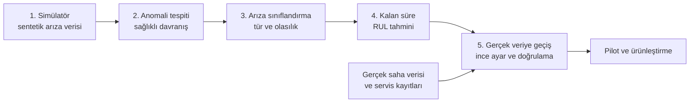
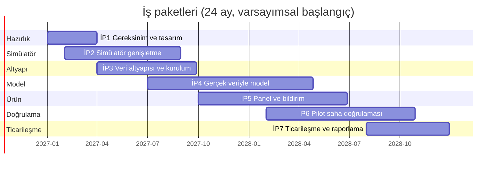

# Yapay Zekâ Destekli Soğutma Arıza Tahmini — Proje Başvuru Taslağı

> **Bu belge bir başvuru taslağıdır.** Türkiye'deki Ar-Ge destek programlarına (ör. TÜBİTAK 1501/1507
> veya KOSGEB Ar-Ge destekleri) yapılacak bir başvurunun içeriğini hazırlamak için yazılmıştır;
> **hiçbir resmî başvuru şablonunun birebir karşılığı değildir.** Başvurulacak program, çağrı ve
> uygunluk koşulları güncel program metinlerinden kontrol edilmeli; içerik ilgili şablona uyarlanmalıdır.
>
> Köşeli parantezli ifadeler (`[...]`) **doldurulması gereken yer tutuculardır**. Bu belgedeki "hedef"
> ifadeleri planlanan başarı ölçütleridir; ulaşılmış sonuç değildir. Mevcut prototipin sonuçları yalnızca
> sentetik veri üzerindedir (bkz. [model-karti.md](model-karti.md)).

| | |
|---|---|
| Proje adı | Yapay Zekâ Destekli Soğutma Arıza Tahmini |
| Başvuran kuruluş | [Firma adı ve unvanı] |
| Proje süresi (öneri) | 24 ay |
| Hedef program | [Program ve çağrı belirlenecek] |
| Proje yürütücüsü | [Ad Soyad, unvan] |
| Taslak tarihi | [gg.aa.yyyy] |

## İçindekiler

1. [Özet](#1-özet)
2. [Problem ve motivasyon](#2-problem-ve-motivasyon)
3. [Amaç ve hedefler](#3-amaç-ve-hedefler)
4. [Yenilikçi yön / özgün değer](#4-yenilikçi-yön--özgün-değer)
5. [Yöntem](#5-yöntem)
6. [İş paketleri ve iş-zaman çizelgesi](#6-iş-paketleri-ve-iş-zaman-çizelgesi)
7. [Riskler ve B planları](#7-riskler-ve-b-planları)
8. [Yaygın etki ve ticarileşme](#8-yaygın-etki-ve-ticarileşme)
9. [Bütçe kalemleri](#9-bütçe-kalemleri)
10. [Ekip](#10-ekip)
11. [Mevcut durum: demo prototip](#11-mevcut-durum-demo-prototip)

---

## 1. Özet

Soğuk odalar ve ticari soğutma sistemleri; gıda, süt ürünleri, et, ilaç ve çiçek gibi ürünlerin
saklanmasında kritik altyapıdır. Bu sistemlerdeki arızalar çoğunlukla ani değil, **günler-haftalar süren
bir bozulmanın sonucudur**: gaz kaçağı, kirlenen kondenser, buzlanan evaporatör, aşınan kompresör veya
bozulan kondenser fanı; basınç, sıcaklık, akım ve titreşim sinyallerinde küçük ama sistematik değişimler
bırakır. Bugün bu değişimler çoğu zaman yalnızca arıza gerçekleştikten sonra fark edilmektedir.

Bu proje; soğutma ünitelerinden sürekli ölçüm alan, **arızayı gerçekleşmeden önce tespit eden, türünü
belirleyen ve arızaya kalan süreyi tahmin eden** bir kestirimci bakım sistemi geliştirmeyi amaçlar. Sistem
dört katmandan oluşur: (1) sahadaki sensör ve ağ geçidi altyapısı, (2) zaman serisi veri platformu,
(3) sağlıklı davranışı öğrenen anomali tespiti ile arıza türü sınıflandırma ve kalan süre tahmini
modelleri, (4) servis ekibine uyarı ileten izleme paneli.

Etiketli gerçek arıza verisi bulunmadığı için yaklaşım, **fizik esaslı bir simülatörde ön eğitim** ve
ardından **pilot sahalarda toplanan gerçek veriyle ince ayar** (transfer) stratejisine dayanır. Simülatör,
5 arıza türü için çalışan bir demo prototip hâlinde hazırdır. Projenin ana işi; bu yaklaşımı gerçek
ekipman ve gerçek veriyle doğrulamak, ürünleştirmek ve ölçülebilir sahada başarım değerleri elde
etmektir.

**Anahtar kelimeler:** kestirimci bakım, soğutma, soğuk oda, anomali tespiti, kalan faydalı ömür (RUL),
nesnelerin interneti (IoT), transfer öğrenme.

## 2. Problem ve motivasyon

### 2.1 Problem

- Bir soğuk odanın beklenmedik arızası; **ürün kaybı**, acil servis maliyeti, plansız duruş ve
  müşteri memnuniyetsizliği doğurur.
- Mevcut bakım yaklaşımı çoğunlukla **tepkisel** (arıza sonrası) veya **takvim tabanlı** (periyodik
  bakım) şeklindedir. Tepkisel yaklaşım arıza maliyetini en yüksek noktada yaşatır; takvim tabanlı
  yaklaşım ise gerekmeyen bakımlara ve yine de kaçan arızalara yol açabilir.
- Oda sıcaklığına bakan basit eşik alarmları, arıza **sıcaklığa yansıdığında** (yani geç) uyarır;
  soğutma sistemi sıcaklığı bir süre telafi edebildiği için erken belirtiler maskelenir.
- Arıza türünü ve aciliyetini ayırt etmek deneyim gerektirir; servis ekibi sahaya gitmeden neyle
  karşılaşacağını bilmez.

### 2.2 Motivasyon

- Arızaların önemli bölümü kademeli ilerlediği için, doğru sinyaller **birlikte** izlendiğinde günler
  öncesinden fark edilebilir (kızgınlık, aşırı soğutma, yoğuşma yaklaşımı, kompresör akımı, titreşim vb.).
- Arıza türü önceden bilindiğinde servis ekibi doğru yedek parça ve ekipmanla, planlı olarak
  müdahale edebilir.
- Düşük maliyetli IoT sensörleri, bulut/edge altyapısı ve olgunlaşmış makine öğrenmesi araçları, bu tür
  bir sistemi küçük ve orta ölçekli işletmeler için erişilebilir hâle getirmiştir.

### 2.3 Pazar ve ihtiyaç verileri

- Türkiye'de ticari soğutma / soğuk zincir pazarının büyüklüğü: **[kaynak ve veri eklenecek]**
- Soğuk oda ve ticari soğutma ünite sayısı: **[kaynak ve veri eklenecek]**
- Soğutma kaynaklı gıda kaybı ve arıza maliyeti: **[kaynak ve veri eklenecek]**
- Soğutma sistemlerinin enerji tüketimindeki payı: **[kaynak ve veri eklenecek]**
- Hedef müşteri segmentlerindeki (market zincirleri, gıda üreticileri, soğuk hava depoları, lojistik,
  ilaç/sağlık) soğutma ünitesi sayısı: **[kaynak ve veri eklenecek]**

## 3. Amaç ve hedefler

### 3.1 Ana amaç

Soğuk oda soğutma sistemlerinde arızaları, ürün bozulmadan **önce** tespit eden, türünü belirleyen ve
kalan süreyi tahmin eden; gerçek sahada doğrulanmış, ürünleştirilebilir bir kestirimci bakım sistemi
geliştirmek.

### 3.2 Alt amaçlar

1. Sahaya kurulabilir, düşük maliyetli ve güvenli (yalnızca izleyen, kontrol cihazına yazmayan) bir veri toplama altyapısı kurmak.
2. Simülatörü gerçek veriyle kalibre ederek ve genişleterek (çoklu arıza, sensör arızası, farklı gaz ve ekipman tipleri) gerçekçiliğini artırmak.
3. Simülatörde ön eğitilmiş modelleri gerçek veriyle ince ayarlamak ve gerçek sahada doğrulamak.
4. Servis ekibinin kullanacağı, açıklanabilir ve bildirim gönderen bir izleme paneli geliştirmek.
5. Ticarileşme için iş modelini ve ürün paketini netleştirmek.

### 3.3 Ölçülebilir hedefler

> **Aşağıdaki değerler önerilen başarı ölçütleridir (hedef).** Pilot sahanın özellikleri ve ilk
> veriler görüldükten sonra, başvuru aşamasında ve proje başında gözden geçirilmelidir. Prototipin
> sentetik veride elde ettiği sonuçlar bu hedeflerin ulaşılabilir olduğunu **kanıtlamaz**.

| # | Gösterge | Hedef | Ölçüm yöntemi |
|---|---|---|---|
| H1 | Pilot kapsamındaki soğutma ünitesi sayısı | [N] ünite, en az [M] farklı işletme | Kurulum kayıtları |
| H2 | Veri kullanılabilirliği | Sensör verisinin en az %[X] oranında eksiksiz alınması | Veri platformu kalite raporu |
| H3 | Arıza yakalama oranı (gerçek arızalar) | Arıza anından önce yakalama ≥ %[X] | Servis kayıtlarıyla eşleştirme |
| H4 | Erken uyarı süresi | Medyan ≥ [X] saat (≥ 72 saat önerilir) | Alarm zamanı ile arıza/servis zamanı farkı |
| H5 | Yanlış alarm | Ünite başına ayda ≤ [X] yanlış alarm | Teknisyen teyidi |
| H6 | Arıza türü doğruluğu | ≥ %[X] | Sahada teyit edilen neden ile karşılaştırma |
| H7 | Kalan süre tahmini hatası | Medyan mutlak hata ≤ [X] saat / %[X] | Gerçekleşen ile tahmin edilen |
| H8 | Planlı müdahale oranı | Uyarılı arızaların ≥ %[X]'inde müdahalenin arıza öncesinde yapılması | Servis kayıtları |
| H9 | Uçtan uca gecikme | Veri alımından uyarıya ≤ [X] dk (saatlik özniteliklerle) | Sistem logları |
| H10 | Sistem kullanılabilirliği | ≥ %[X] | İzleme kayıtları |

## 4. Yenilikçi yön / özgün değer

> Bu bölümdeki konumlandırma iddiaları, **ayrıntılı bir literatür ve rakip analiziyle
> desteklenmelidir:** [literatür ve rakip analizi eklenecek].

Projenin öne çıkan yönleri:

1. **Etiketsiz başlangıç:** Saha etiketli arıza verisi olmadığında bile, yalnızca sağlıklı çalışmadan
   öğrenen anomali tespiti (Isolation Forest) ilk günden çalışır; arıza etiketleri biriktikçe denetimli
   modeller devreye girer.
2. **Simülatör destekli ön eğitim ve transfer:** Nadir ve pahalı arıza verisi, fizik esaslı bir
   simülatörle üretilerek modellerin başlangıç noktası oluşturulur; gerçek veri ile ince ayar yapılır.
3. **Alana özgü öznitelikler:** Ham sensör yerine soğutma çevrimi bilgisinden türetilen öznitelikler
   (kızgınlık, aşırı soğutma, yoğuşma yaklaşımı, oda–evaporatör farkı, çalışma oranı, defrost tepe
   sıcaklığı) kullanılır. Bu sayede model, teknisyenin mantığıyla uyumlu ve açıklanabilir olur.
4. **Arıza türü + kalan süre + aciliyet bir arada:** Yalnızca "anormal" demek yerine, hangi arıza
   olduğu, ne kadar süre kaldığı ve ne yapılması gerektiği bilgisi servis ekibine verilir.
5. **Açıklanabilirlik:** Her uyarıda, modelin hangi sinyallerin normal çalışmadan ne kadar saptığına
   dikkat çektiği gösterilir.
6. **Düşük maliyetli ve kontrolden bağımsız izleme:** Sistem, soğutma kontrol cihazına müdahale etmeden
   yalnızca izler; mevcut kontrol cihazlarından (Modbus ile) veya ek sensörlerle beslenebilir.

## 5. Yöntem

### 5.1 Genel yaklaşım

### 5.2 Simülatör

Fizik esaslı bir soğuk oda simülatörü (termostat kontrollü kompresör, periyodik defrost, kapı açılışları,
günlük dış ortam döngüsü, R404A doyma basıncı yaklaşımı) ve 5 arıza türü (gaz kaçağı, kondenser kirlenmesi,
evaporatör buzlanması, kompresör aşınması, kondenser fanı arızası) için ilerleyen şiddet eğrisi
mevcuttur. Proje boyunca:

- Gerçek ölçümlerle **kalibre edilecek** (sinyal aralıkları, gürültü, dinamikler),
- **Genişletilecek:** çoklu arıza, sensör arızaları, dondurucu (−18 °C) ve diğer ekipman tipleri, farklı
  soğutucu akışkanlar, ani arızalar, talebe bağlı defrost, ürün yükü etkisi.

### 5.3 Anomali tespiti

Isolation Forest, yalnızca sağlıklı çalışma verisinden öğrenir. Çıktısı 0–1 arası bir anomali skorudur.
Etiket gerektirmediği için pilot sahada ilk günlerde kullanılabilir; ayrıca modele tanıtılmamış arıza
türlerine karşı bir güvenlik ağı sağlar. Gerçek sahada sağlıklı davranış, her ünite veya ünite grubu için
ayrı kalibre edilecektir.

### 5.4 Arıza türü sınıflandırma

Saatlik öznitelikler (12 saatlik kayan pencere) üzerinde gradyan artırmalı karar ağaçları (histogram
tabanlı) ile 5 arıza türü + normal sınıfı ayrıştırılır; olasılık çıktısı sağlık skorunun bileşenidir
(`sağlık = 100·(0,6·P(normal) + 0,4·(1−anomali))`). Proje kapsamında arıza türleri genişletilecek ve
olasılık kalibrasyonu yapılacaktır.

### 5.5 Kalan süre (RUL) tahmini

Arıza etiketli veriler üzerinde, arızaya kalan sürenin (log ölçeğinde) regresyonu yapılır. Tek nokta
tahmininin ötesinde, **belirsizlik aralığı** (ör. kantil regresyonu veya konformal tahmin) eklenmesi
planlanmaktadır; çünkü gerçek bozulma hızları arızadan arızaya çok değişir.

### 5.6 Gerçek veriye geçiş (transfer)

1. Pilot sahalara sensör ve IoT ağ geçidi kurulumu veya mevcut kontrol cihazlarından okuma.
2. **Gölge modu:** 1–3 ay uyarı göndermeden veri toplama; servis kayıtlarının arızalarla eşleştirilmesi.
3. Simülatör ile gerçek veri dağılımlarının karşılaştırılması; simülatör kalibrasyonu.
4. Simülatörde eğitilmiş modelin gerçek veriyle ince ayarı; öznitelik ve eşiklerin yeniden kalibrasyonu.
5. Saha doğrulaması: yakalama oranı, erken uyarı süresi, yanlış alarm, kalan süre hatası.
6. Sürekli öğrenme: servis geri bildirimiyle etiketleme ve periyodik yeniden eğitim.

Saha altyapısı ayrıntıları için: [saha-mimarisi.md](saha-mimarisi.md).

### 5.7 Değerlendirme ilkeleri

- Test, eğitimde kullanılmayan **ünitelerde ve işletmelerde** yapılır; zaman bazlı ayırma uygulanır.
- Yalnızca saatlik doğruluğa değil; **yakalama oranı, erken uyarı süresi ve yanlış alarm oranına** bakılır.
- Sonuçlar belirsizlik aralıklarıyla raporlanır; küçük örneklem uyarısı yapılır.
- Model Kartı ([model-karti.md](model-karti.md)) her sürümle güncellenir.

## 6. İş paketleri ve iş-zaman çizelgesi

> Süreler **öneridir**; sahaların ve ekibin durumuna göre revize edilecektir. Toplam süre 24 ay varsayılmıştır.

| İP No | İş paketi adı | Süre (ay) | Çıktılar | Başarı ölçütü |
|---|---|---|---|---|
| İP1 | Gereksinim analizi, pilot saha seçimi ve sensör/mimari tasarımı | 1–3 (3 ay) | Gereksinim belgesi; pilot saha listesi; sensör ve ağ geçidi seçimi; saha mimarisi tasarımı | Pilot sahalar için yazılı mutabakat (en az [M] işletme); onaylı sensör/mimari tasarımı |
| İP2 | Simülatörün genişletilmesi ve kalibrasyonu | 2–8 (7 ay) | Genişletilmiş simülatör (çoklu arıza, sensör arızası, yeni ekipman/gaz tipleri); gerçek veriyle kalibrasyon raporu | Simülatör sinyal dağılımlarının gerçek veriyle belirlenen yakınlık ölçütünü sağlaması: [ölçüt belirlenecek] |
| İP3 | Veri toplama altyapısı ve pilot kurulum | 4–9 (6 ay) | Ağ geçidi yazılımı; MQTT/zaman serisi veri platformu; [N] ünitede kurulum; veri kalite izleme | H1 ve H2 hedeflerinin sağlanması |
| İP4 | Gerçek veriyle model geliştirme | 7–16 (10 ay) | İnce ayarlı anomali/sınıflandırma/kalan süre modelleri; belirsizlik tahmini; sensör arızası tespiti; güncel Model Kartı | H3–H7 hedeflerinin pilot verisi üzerinde karşılanması (bekletilmiş ünitelerde) |
| İP5 | İzleme paneli ve bildirim sistemi | 10–18 (9 ay) | Çok müşterili panel; SMS/WhatsApp/e-posta bildirimi; servis iş akışı entegrasyonu; yetkilendirme | Kullanıcı kabul testleri (servis ekibi); H9 ve H10 |
| İP6 | Pilot saha doğrulaması | 14–22 (9 ay) | Canlı uyarı dönemi; servis kayıtlarıyla eşleştirilmiş sonuçlar; saha doğrulama raporu | H3–H8 hedeflerinin canlı pilotta ölçülmesi ve raporlanması |
| İP7 | Ticarileşme, yaygınlaştırma ve raporlama | 20–24 (5 ay) | İş modeli ve fiyatlandırma; ürün paketi; pazara giriş planı; nihai proje raporu | İlk ticari pilot sözleşmesi/niyet mektupları: [sayı belirlenecek]; kabul edilmiş nihai rapor |

Tüm proje boyunca **proje yönetimi, raporlama ve veri güvenliği** faaliyetleri sürdürülür.

### Zaman çizelgesi

> Çizelgedeki tarihler yalnızca ay ölçeğini göstermek için **varsayımsal bir başlangıç** (Ocak 2027) kullanır;
> gerçek tarihler başvuru ve onay sürecine göre belirlenecektir.

## 7. Riskler ve B planları

| # | Risk | Olasılık | Etki | Önleme / azaltma | B planı |
|---|---|---|---|---|---|
| R1 | **Simülatör–gerçek fark:** Simülatörde eğitilen modelin gerçek veride düşük başarım göstermesi | Yüksek | Yüksek | Erken pilot veri toplama; gölge modu; simülatör kalibrasyonu; ince ayar | Gerçek veri ağırlıklı yeniden eğitim; önce etiketsiz anomali tespiti ile hizmet verme |
| R2 | **Yeterli gerçek arıza verisi toplanamaması** (arızalar nadirdir) | Yüksek | Yüksek | Çok sayıda ünite ve işletme; geçmiş servis kayıtlarının kullanımı; kontrollü/sentetik arıza denemeleri (ör. bakım sırasında kondenser kapatma, fan devre dışı bırakma — yalnızca güvenli ve onaylı koşullarda) | Pilot süresini uzatma; arıza türü kapsamını daraltma (en sık görülen arızalara odaklanma) |
| R3 | **Sensör güvenilirliği ve veri kalitesi** (kopma, kayma, takılı değer) | Orta | Yüksek | Sensör sağlık kontrolleri; kalibrasyon; veri kalitesi izleme; sensör arızası tespit modeli | Yedek sensör; kritik büyüklüklerde kontrol cihazı verisini çapraz kullanma |
| R4 | **Yanlış alarm yorgunluğu**, kullanıcı güveninin düşmesi | Orta | Yüksek | Ardışık saat kuralı; eşik kalibrasyonu; gölge modunda önceden değerlendirme; geri bildirim | Eşiklerin sıkılaştırılması; yalnızca yüksek güvenli uyarılar; teknisyen onayı akışı |
| R5 | **Sahaya erişim ve işletme izni**, pilot işletmelerin vazgeçmesi | Orta | Orta | Önceden yazılı mutabakat; yedek işletme listesi; minimum müdahaleli kurulum | Alternatif pilot işletmeler; kendi tesislerimizde test düzeneği |
| R6 | **Bağlantı sorunları** (internet kesintisi, kapsama) | Orta | Orta | Ağ geçidinde yerel tamponlama; yeniden gönderim; hücresel yedek | Veriyi sonradan toplu aktarma |
| R7 | **Ekipman çeşitliliği** (marka, gaz, kapasite) nedeniyle modelin genellenememesi | Orta | Orta | Ünite meta verisi; ünite başına kalibrasyon; yeniden eğitim | Ekipman gruplarına özel modeller |
| R8 | **Güvenlik ve veri gizliliği** (ağ saldırıları, müşteri verisi) | Düşük–Orta | Yüksek | TLS, cihaz kimlik doğrulama, ağ ayrımı, yalnızca okuma mimarisi; KVKK değerlendirmesi | Güvenlik denetimi; veri minimizasyonu |
| R9 | **Ekip ve süre riski** (nitelikli personel, gecikme) | Orta | Orta | İş paketlerinde esneklik; danışmanlık/üniversite iş birliği | Kapsam daraltma; dışarıdan hizmet alımı |
| R10 | **Pazar kabulü ve fiyat hassasiyeti** | Orta | Orta | Erken müşteri görüşmeleri; kullanım senaryosuna göre paketleme | Hizmet modelini (aylık abonelik / hizmet sözleşmesi) esnetme |
| R11 | **Yanlış güven riski:** Sistemin "normal" demesine aşırı güvenilmesi | Orta | Yüksek | Kapsam sınırlarının açıkça belirtilmesi; sistem koruma ekipmanlarının yerine geçmez | Mevcut bakım prosedürlerinin sürdürülmesi |

## 8. Yaygın etki ve ticarileşme

### 8.1 Beklenen etkiler

- **Ekonomik:** Plansız arıza ve ürün kaybında azalma, planlı bakım ve yedek parça yönetimi,
  enerji verimliliği kazanımı (ör. kirli kondenser ve buzlanma kaynaklı fazla tüketimin erken
  giderilmesi). Büyüklükler pilot sonrası ölçülecektir: **[ölçüm ve kaynak eklenecek]**.
- **Toplumsal / çevresel:** Gıda kaybı ve atığının azalması; soğutucu gaz kaçaklarının erken tespiti ile
  çevresel etkinin azalması (gaz kaçağı tespitinin etkisi: **[kaynak ve veri eklenecek]**).
- **Teknolojik:** Soğutma sektöründe veri odaklı bakım kültürü; yerli bir kestirimci bakım ürünü
  ve sentetik veri/simülasyon destekli model geliştirme birikimi.

### 8.2 Hedef müşteri segmentleri

Market ve perakende zincirleri, gıda üreticileri ve toptancıları, soğuk hava depoları ve lojistik
firmaları, ilaç/sağlık depoları, otel ve toplu yemek işletmeleri, soğutma servis firmaları
(servis ekiplerinin kendi müşterilerine hizmeti olarak). Pazar büyüklüğü ve segment ağırlıkları:
**[kaynak ve veri eklenecek]**.

### 8.3 İş modeli seçenekleri

| Seçenek | Açıklama | Artılar | Eksiler | Fiyat |
|---|---|---|---|---|
| **SaaS — ünite başına aylık abonelik** | Müşteri, izlenen her soğutma ünitesi için aylık ücret öder; panel + uyarılar + model dâhildir | Öngörülebilir gelir; ölçeklenebilir | Donanım maliyeti ve kurulum için ayrı bir kalem gerekebilir | [fiyat belirlenecek] |
| **Donanım + abonelik** | Sensör/ağ geçidi paketi bir kerelik satılır veya kiralanır; yazılım abonelik | Donanım maliyeti karşılanır | Müşteri için ilk maliyet yüksek olabilir | [fiyat belirlenecek] |
| **Servis sözleşmesine entegre (B2B2B)** | Soğutma servis firmaları sistemi kendi bakım sözleşmelerine ekler | Mevcut müşteri ilişkisi; hızlı yayılım | Servis firmalarına bağımlılık | [fiyat belirlenecek] |
| **Sonuç tabanlı** | Önlenen arıza veya sağlanan tasarruf üzerinden pay | Müşteri için düşük risk | Ölçüm ve ispat zorluğu; gelir belirsizliği | [model ve oran belirlenecek] |
| **Kurulum + danışmanlık** | Tek seferlik kurulum ve analiz projeleri | Hızlı gelir | Tekrarlayan gelir yok | [fiyat belirlenecek] |

### 8.4 Ticarileşme adımları

1. Pilot sonuçlarının raporlanması ve referans müşteri vakaları.
2. Ürün paketlerinin (başlangıç / standart / kurumsal) belirlenmesi.
3. Satış ve kanal stratejisi (doğrudan satış, servis firmaları, distribütörler): [strateji belirlenecek].
4. Destek, kurulum ve saha servis süreçlerinin kurulması.
5. Fikrî mülkiyet değerlendirmesi (yazılım telif, marka, olası patent/faydalı model uygunluğu): [değerlendirilecek].

### 8.5 Rekabet

Piyasada sıcaklık izleme, uzaktan izleme ve eşik tabanlı alarm çözümleri bulunmaktadır. Rakip ürünlerin
kapsamı, fiyatları ve yöntemleri incelenmeli ve burada yer almalıdır: **[rakip analizi eklenecek]**.

## 9. Bütçe kalemleri

> Yalnızca kalem kategorileri verilmiştir; tutarlar başvuru aşamasında teklifler ve program kurallarına
> göre doldurulacaktır. Program kapsamında hangi kalemlerin desteklendiği, ilgili çağrı metninden
> kontrol edilmelidir.

| Kalem | Açıklama | Tutar |
|---|---|---|
| Personel giderleri | Proje yürütücüsü, veri bilimci/ML mühendisi, gömülü sistem/IoT mühendisi, yazılım geliştirici, soğutma teknisyeni/mühendisi | [tutar] |
| Makine–teçhizat / donanım | Sensörler (basınç, sıcaklık, akım, titreşim, kapı), ağ geçitleri, panolar, kablolama, test düzeneği | [tutar] |
| Yazılım ve bulut hizmetleri | Bulut altyapısı, veri tabanı, izleme, bildirim hizmetleri (SMS/WhatsApp), geliştirme araçları | [tutar] |
| Hizmet alımları | Danışmanlık, üniversite/araştırma kuruluşu iş birliği, güvenlik denetimi, hukuki/KVKK danışmanlığı | [tutar] |
| Seyahat | Saha ziyaretleri, kurulum ve bakım | [tutar] |
| Sarf malzeme | Montaj malzemesi, kablo, konnektör, yedek sensör | [tutar] |
| Test ve doğrulama | Kalibrasyon hizmetleri, referans ölçüm cihazları | [tutar] |
| Fikrî mülkiyet / tanıtım | Marka/patent başvuruları, tanıtım materyali | [tutar] |
| Genel giderler | Program kurallarına göre | [tutar] |
| **Toplam** | | **[toplam]** |

## 10. Ekip

| Rol | Ad Soyad | Görev ve sorumluluk | Uzmanlık / deneyim | Çalışma oranı |
|---|---|---|---|---|
| Proje yürütücüsü | [Ad Soyad] | Genel yönetim, saha ve müşteri ilişkileri | [bilgi eklenecek] | [%] |
| Veri bilimci / ML mühendisi | [Ad Soyad] | Simülatör, öznitelik, model geliştirme | [bilgi eklenecek] | [%] |
| Gömülü sistem / IoT mühendisi | [Ad Soyad] | Sensör, ağ geçidi, MQTT | [bilgi eklenecek] | [%] |
| Yazılım geliştirici | [Ad Soyad] | Veri platformu, panel, bildirimler | [bilgi eklenecek] | [%] |
| Soğutma uzmanı / servis mühendisi | [Ad Soyad] | Arıza bilgisi, saha doğrulama, etiketleme | [bilgi eklenecek] | [%] |
| Danışman / akademik iş birliği | [Kurum / Ad Soyad] | Yöntem danışmanlığı | [bilgi eklenecek] | [%] |

Başvuran kuruluşun geçmişi, kapasitesi ve referansları: **[firma bilgileri eklenecek]**.

## 11. Mevcut durum: demo prototip

Bu depodaki prototip, projenin başlangıç noktasıdır:

- Fizik esaslı soğuk oda simülatörü ve 5 arıza türü.
- Anomali tespiti (Isolation Forest), arıza sınıflandırma ve kalan süre regresyonu (histogram tabanlı gradyan artırma).
- Sağlık skoru ve Normal / İzlemede / Kritik durumları; açıklanabilir sinyal sapmaları.
- Streamlit izleme paneli ve 30 günlük canlı oynatma senaryosu.
- Sentetik test filosunda (40 ünite) elde edilen sonuçlar: saatlik doğruluk %99,5, makro F1 0,992, arıza
  öncesi yakalama 25/25, medyan erken uyarı ≈ 6,6 gün, 0/40 yanlış alarm. **Bu değerler sentetik veri
  üzerindedir** ve gerçek saha performansını göstermez. Ayrıntılar ve sınırlılıklar: [model-karti.md](model-karti.md).

Kendi değerlendirmemizle bu çalışma, **kavram kanıtı** aşamasındadır (laboratuvar/simülasyon düzeyi);
resmî teknoloji hazırlık seviyesi (TRL) beyanı başvuru sırasında yapılmalıdır: **[TRL değerlendirmesi eklenecek]**.
Projenin hedefi, sistemi gerçek işletme ortamında doğrulanmış bir ürüne dönüştürmektir.
