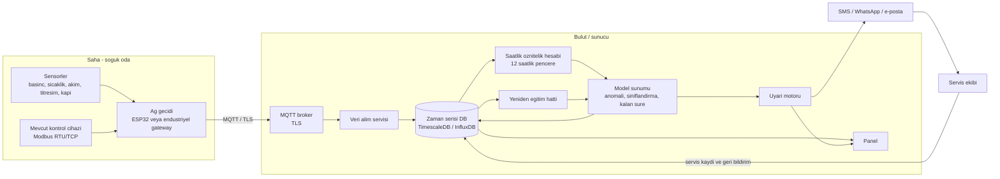
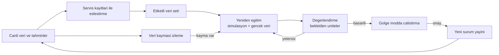
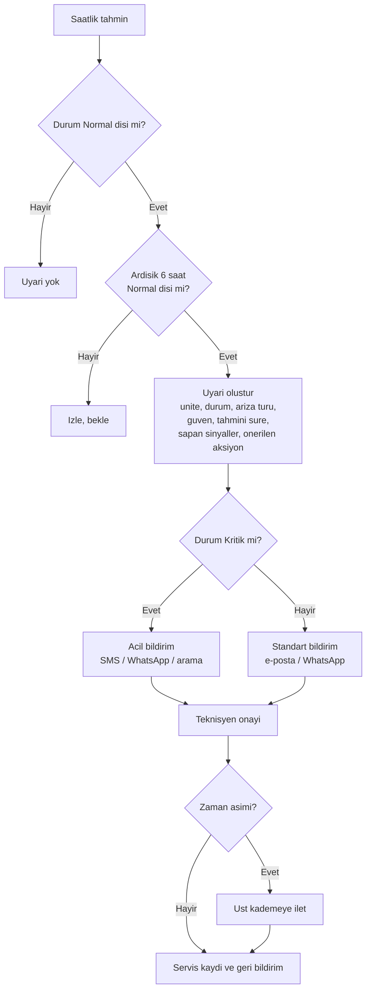

# Saha Mimarisi — Demo Prototipten Gerçek Sahaya

Bu belge, demo prototipin (sentetik veri) gerçek soğuk odalarda çalışan bir sisteme dönüşmesi için
**önerilen** saha ve veri mimarisini tanımlar. Bir tasarım önerisidir; hiçbir bileşen henüz sahada
denenmemiştir. Sensör modelleri, aralıklar ve örnekleme hızları **başlangıç önerileridir** ve pilot
öncesinde ekipman üreticisi belgeleri ve saha koşullarıyla doğrulanmalıdır. Donanım maliyetlerine bilerek
yer verilmemiştir; teklif alınarak belirlenmelidir.

İlgili belgeler: [Model Kartı](model-karti.md) · [Proje Dokümanı](proje-dokumani.md) ·
Gerçek veri biçimi: [Veri formatı (yakında)](veri-formati.md) ·
Depo: <https://github.com/mirzayildiran/sogutma-ariza-tahmini>

## İçindekiler

1. [Tasarım ilkeleri](#1-tasarım-ilkeleri)
2. [Mimari genel bakış](#2-mimari-genel-bakış)
3. [Ölçülecek büyüklükler ve sensörler](#3-ölçülecek-büyüklükler-ve-sensörler)
4. [Örnekleme hızları](#4-örnekleme-hızları)
5. [Ağ geçidi (gateway) seçenekleri](#5-ağ-geçidi-gateway-seçenekleri)
6. [MQTT konu yapısı ve veri biçimi](#6-mqtt-konu-yapısı-ve-veri-biçimi)
7. [Depolama](#7-depolama)
8. [Model sunumu ve yeniden eğitim döngüsü](#8-model-sunumu-ve-yeniden-eğitim-döngüsü)
9. [Uyarı akışı](#9-uyarı-akışı)
10. [Güvenlik](#10-güvenlik)
11. [Aşamalı devreye alma](#11-aşamalı-devreye-alma)

---

## 1. Tasarım ilkeleri

- **Yalnızca izleme:** Sistem soğutma kontrol cihazına komut yazmaz; sensörler ve salt okunur Modbus
  erişimi kullanılır. Böylece arıza durumunda mevcut koruma ve kontrol mantığı etkilenmez.
- **Koruma ekipmanı değildir:** Sistem; basınç şalteri, termik röle, alarm cihazı veya resmî sıcaklık kaydı
  (ör. HACCP) yerine geçmez.
- **Çevrimdışı dayanıklılık:** Ağ geçidi internet kesildiğinde veriyi yerelde tamponlar, bağlantı gelince gönderir.
- **Dışa doğru bağlantı:** Sahadan buluta yalnızca giden (outbound) bağlantılar; sahada gelen bağlantı portu açılmaz.
- **Eğitim–sunum tutarlılığı:** Öznitelikler eğitimdeki ile aynı kodla (`sogutma/features.py`) hesaplanmalıdır.
- **Veri kalitesi önce:** Takılı kalan, aralık dışı veya kopuk sensörler model girdisine ulaşmadan işaretlenmelidir (mevcut model sensör arızalarını bilmez; bkz. [Model Kartı](model-karti.md#8-sınırlılıklar-ve-riskler)).

## 2. Mimari genel bakış



Mevcut demoda saha katmanının yerini simülatör alır; öznitelik, model ve panel katmanları bu depodaki
koddur. Bulut/sunucu tarafındaki veri alımı, veri tabanı, uyarı motoru ve yeniden eğitim hattı bu belgenin
önerisidir ve **henüz uygulanmamıştır**.

## 3. Ölçülecek büyüklükler ve sensörler

Demo modelin 15 özniteliği (bkz. [Model Kartı](model-karti.md#4-öznitelikler)), aşağıdaki ölçümlerden
türetilir. Tablodaki sensör tipleri örnektir; seçim, ekipmanın gücüne, gazına ve ortam koşullarına bağlıdır.

| Büyüklük | Nereye takılır | Sensör tipi (öneri) | Çıkış | Model girdisi |
|---|---|---|---|---|
| Emme basıncı | Kompresör emme hattı servis portu (Schrader/tee) | Basınç transdüseri; ör. 0–10 / 0–16 bar aralığı [aralık seçilecek] | 4–20 mA veya 0,5–4,5 V oransal | `p_suc`; `evap_delta`, `sh` için gerekli |
| Basma (yoğuşma) basıncı | Kompresör basma hattı / kondenser girişi | Basınç transdüseri; ör. 0–30 bar, 4–20 mA | 4–20 mA | `p_dis`; `cond_approach`, `sc` için gerekli |
| Emme hattı sıcaklığı | Evaporatör çıkışı / kompresör girişi, boru üzerine yalıtımlı kelepçeli | PT1000 veya NTC (boru kelepçeli) | Direnç / ADC | `sh` (kızgınlık) = emme hattı sıcaklığı − doyma sıcaklığı(`p_suc`) |
| Sıvı hattı sıcaklığı | Kondenser çıkışı / genleşme valfi öncesi sıvı hattı | PT1000 veya NTC | Direnç / ADC | `sc` (aşırı soğutma) = doyma sıcaklığı(`p_dis`) − sıvı hattı sıcaklığı |
| Basma hattı sıcaklığı | Kompresör çıkışına yakın basma hattı | PT1000 (yüksek sıcaklık aralığı) | Direnç / ADC | `t_dis` |
| Oda sıcaklığı | Oda içi, hava dolaşımından ve kapıdan uzak, ürün yüksekliğinde | PT1000 / NTC (veya kontrol cihazının probu) | Direnç / Modbus | `t_room_dev` (hedef sıcaklık ayrıca kaydedilir), `evap_delta` |
| Evaporatör batarya / defrost sıcaklığı | Evaporatör bataryası, defrost sonlandırma sensörünün yanı | PT1000 / NTC (veya kontrol cihazının defrost probu) | Direnç / Modbus | `coil_defrost_peak` |
| Dış ortam sıcaklığı | Kondenserin hava girişinde, doğrudan güneşten korunmuş | PT1000 / NTC (radyasyon kalkanlı) | Direnç / ADC | `t_amb`, `cond_approach` |
| Kompresör akımı | Kompresör besleme fazı (3 fazlıda tercihen her faz) | Açılabilir (split-core) akım trafosu / akım sensörü, ünite akımına uygun aralık | 4–20 mA, 0–10 V veya Modbus | `i_comp`; ayrıca çalışma durumu |
| Kondenser fan akımı | Kondenser fan motoru beslemesi | Açılabilir akım sensörü (küçük akım aralığı) | 4–20 mA / 0–10 V | `i_fan` |
| Titreşim | Kompresör gövdesi (sağlam metal yüzey, manyetik veya vidalı montaj) | MEMS ivmeölçer (tercihen 3 eksen, endüstriyel kılıflı) | I²C/SPI veya dijital çıkışlı modül | `vib` — mm/s RMS hız olarak uç tarafta hesaplanır |
| Kapı durumu | Oda kapısı | Manyetik kontak (reed) | Dijital giriş | Şu anki modelde kullanılmaz; bağlam ve gelecek özellikler için kaydedilir |
| Kompresör / defrost durumu | Kontaktör yardımcı kontağı veya kontrol cihazı çıkışı | Kuru kontak / dijital giriş veya Modbus | Dijital | `duty`, `starts`; defrost anlarının ayrıştırılması |
| Hedef sıcaklık (setpoint) | Kontrol cihazından | Modbus okuma veya elle girilen meta veri | — | `t_room_dev` |

Dikkat edilecek noktalar:

- **Mutlak/bağıl basınç:** Simülatör basıncı **mutlak (bar)** olarak üretir ve doyma eğrisi mutlak basınç
  kullanır. Sahadaki transdüserler çoğunlukla **bağıl (gauge)** basınç verir; mutlak basınca çevrim (≈ +1,013 bar)
  veya modelin buna göre yeniden eğitilmesi gerekir.
- **Doyma sıcaklığı:** Demo kod R404A için yaklaşık bir Antoine tipi eğri (`ln P = A − B/(T + C)`) kullanır (`sogutma/simulator.py`). Sahada
  gaz türüne uygun doğru bir doyma tablosu/kütüphanesi (ör. CoolProp) kullanılmalıdır; gaz değişince
  öznitelikler ve model yeniden değerlendirilmelidir.
- **Kızgınlık / aşırı soğutma:** Demo veride doğrudan üretilir; sahada ölçülen sıcaklık ve basınçtan hesaplanır,
  bu yüzden sıcaklık sensörünün boruya temas kalitesi ve yalıtımı ölçüm doğruluğunu belirler.
- **Titreşim:** Simülatörde mm/s cinsindendir. Ham ivme verisinden bant sınırlı RMS hız hesaplanır; tek
  başına mutlak değerler sahaya özgü olduğu için ünite bazında kalibrasyon gerekir.
- **Kompresör çalışma durumu:** Akım eşiğinden veya kontaktör kontağından türetilebilir; defrost bilgisi
  için kontrol cihazı çıkışı ya da bataryanın sıcaklık profili kullanılabilir.
- **Montaj güvenliği:** Basınç hattına bağlantı ve elektrik panosu çalışmaları yetkili soğutma/elektrik
  teknisyeni tarafından yapılmalıdır. Mümkün olduğunca **harici (clamp-on) ve yalıtımlı** ölçüm tercih edilir.
- **Mevcut kontrol cihazı:** Birçok kontrol cihazı oda, defrost ve bazen basınç/akım bilgisini Modbus ile verir;
  hangi verinin okunabildiği cihaz modeline göre değişir ve ilgili haritadan doğrulanmalıdır. Bu durumda ek
  sensör ihtiyacı azalır.

## 4. Örnekleme hızları

Aşağıdakiler başlangıç önerisidir. Demo modeli **5 dakikalık** veriyle çalışır; hızlı örnekleme uç tarafta
özetlenip 5 dakikalık kayıtlara indirgenir.

| Sinyal grubu | Uç cihazda örnekleme | Buluta gönderilen |
|---|---|---|
| Sıcaklıklar (oda, evaporatör, boru, ortam) | 10–30 sn | 5 dk ortalaması (isteğe bağlı min/maks) |
| Basınçlar | 1–5 sn | 5 dk ortalaması, min, maks |
| Akımlar (kompresör, fan) | 1 sn veya daha hızlı (kalkış akımını görmek için) | 5 dk ortalaması, maks |
| Titreşim | Kısa süreli yüksek hızlı kayıt (ör. birkaç saniye, kHz mertebesi) her 5 dk'da bir | RMS hız, tepe değer ve isteğe bağlı bant enerjileri; ham dalga formu yalnızca teşhis/geliştirme için, seyrek |
| Kompresör / defrost / kapı durumu | Olay tabanlı (değişimde) ve 1 sn yoklama | Olay kayıtları + 5 dk içindeki çalışma süresi / kalkış sayısı |

Gerekçe: Model, kompresör çalışırken (defrost dışı) alınan değerlerin saatlik ortalamasını kullanır. Bu
nedenle her 5 dakikalık kayıtta kompresör çalışırken alınan örneklerin özeti ayrıca işaretlenmelidir.
Gerçek sahadaki verinin frekans ve çözünürlüğünün modele uygunluğu pilotta doğrulanmalıdır.

## 5. Ağ geçidi (gateway) seçenekleri

| Seçenek | Uygun olduğu durum | Artılar | Eksiler / dikkat |
|---|---|---|---|
| **ESP32 tabanlı özel kart** | Pilot, düşük maliyetli çoğaltılabilir kurulum; analog ve dijital girişler doğrudan | Düşük güç ve maliyet; Wi-Fi/Ethernet; MQTT/TLS kütüphaneleri mevcut | Dahili ADC doğruluğu sınırlı: harici ADC (ör. 16 bit) ve 4–20 mA için şönt/koruma devresi önerilir; endüstriyel EMC ve muhafaza tasarımı gerekir; yerel tamponlama için sınırlı bellek |
| **Raspberry Pi sınıfı kart / endüstriyel IoT ağ geçidi** | Birden fazla ünite, yerel veri tamponlama, uç tarafta özellik hesabı | Linux ortamı; Modbus, MQTT, yerel veri tabanı ve uzaktan güncelleme araçları; endüstriyel sürümleri DIN rayına uygun | Tüketici sınıfı kartlarda SD kart dayanıklılığı ve sıcaklık aralığı sorun olabilir; endüstriyel sürümler pahalıdır |
| **Mevcut kontrol cihazından Modbus ile okuma** | Cihazın Modbus RTU (RS-485) / TCP desteklediği ve verinin yeterli olduğu durumlar | Ek sensör ve kablolama azalır; kurulum hızlı | Hangi değişkenlerin açıldığı modele bağlı (basınç, akım, titreşim genellikle yoktur); salt okunur kullanılmalı; cihaz üreticisinin kayıt haritası ve yetkilendirme koşulları doğrulanmalı |
| **Hibrit** | Pratikte en olası seçenek | Kontrol cihazından oda/defrost/çıkışlar, ek sensörlerden basınç, akım, titreşim | İki kaynağın zaman senkronizasyonu ve veri eşleştirmesi gerekir |

Ağ geçidi görevleri: sensör okuma ve ölçekleme; 4–20 mA ve ADC değerlerinin mühendislik birimine çevrimi;
5 dk özetleme; veri kalitesi bayrakları; yerel tamponlama; MQTT/TLS ile gönderim; saat senkronizasyonu (NTP);
uzaktan yapılandırma ve imzalı yazılım güncelleme.

Bağlantı: Ethernet (tercihen) veya Wi-Fi; yedek olarak hücresel modem. Bağlantı türü işletmenin ağ politikasına
göre belirlenir.

## 6. MQTT konu yapısı ve veri biçimi

### Konu yapısı (öneri)

```
sogutma/v1/{site_id}/{unit_id}/telemetry     # 5 dk özet ölçümler (QoS 1)
sogutma/v1/{site_id}/{unit_id}/events        # olaylar: kapı, defrost, kompresör kalkış/duruş (QoS 1)
sogutma/v1/{site_id}/{gateway_id}/status     # cihaz durumu, son görülme (retained, LWT ile)
sogutma/v1/{site_id}/{gateway_id}/config     # uzaktan yapılandırma (sunucu → cihaz)
```

- `site_id`: işletme/lokasyon, `unit_id`: soğutma ünitesi, `gateway_id`: ağ geçidi.
- Her cihaz yalnızca **kendi alt konularına** yayın yapabilmelidir (broker erişim kontrol listeleri ile; bkz. [Güvenlik](#10-güvenlik)).
- Cihaz bağlantı kesildiğinde "son istek" (Last Will) mesajıyla `status` konusuna `offline` yazılır.
- Şema sürümü konu yolunda (`v1`) ve mesaj içinde (`schema`) taşınır.

### Örnek `telemetry` mesajı

Alan adları simülatördeki sütun adlarıyla uyumludur. Ham sensör değerleri ile birlikte türetilmiş
(`sh`, `sc`) değerler ağ geçidinde de sunucuda da hesaplanabilir; sunucuda hesaplamak, gaz tablosunun merkezi
güncellenmesini kolaylaştırır.

```json
{
  "schema": 1,
  "ts": "2027-03-14T09:05:00Z",
  "site_id": "S001",
  "unit_id": "A1",
  "gateway_id": "GW-0001",
  "interval_s": 300,
  "setpoint_c": 2.0,
  "t_amb": 22.4,
  "t_room": 2.6,
  "t_coil": -4.1,
  "p_suc_bar": {"mean": 3.9, "min": 3.6, "max": 4.2},
  "p_dis_bar": {"mean": 13.8, "min": 13.1, "max": 14.4},
  "t_suction_line": 6.5,
  "t_liquid_line": 29.8,
  "t_dis": 71.2,
  "i_comp_a": {"mean": 8.9, "max": 22.5},
  "i_fan_a": 1.2,
  "vib_rms_mms": 1.6,
  "comp_run_s": 210,
  "comp_starts": 1,
  "defrost_s": 0,
  "door_open_s": 14,
  "pressure_ref": "absolute",
  "refrigerant": "R404A",
  "quality": {"p_suc": "ok", "p_dis": "ok", "t_liquid_line": "ok", "vib": "ok"},
  "fw": "0.1.0"
}
```

Not: Mesajdaki değerler yalnızca biçimi göstermek için uydurulmuş örneklerdir; gerçek bir ölçümü temsil etmez.

### Örnek `events` mesajı

```json
{"schema": 1, "ts": "2027-03-14T09:12:41Z", "unit_id": "A1", "type": "door_open", "duration_s": 38}
```

## 7. Depolama

Zaman serisi veri için **TimescaleDB** (PostgreSQL uzantısı; SQL, ilişkisel meta veri ile birleştirme
kolaylığı) veya **InfluxDB** kullanılabilir. TimescaleDB ile ilerlenirse servis kayıtları, ünite meta verisi
ve model çıktıları aynı veri tabanında tutulabilir. Seçim, ekibin deneyimine ve işletme maliyetine göre
yapılmalıdır.

### Örnek tablo şeması (TimescaleDB)

```sql
CREATE EXTENSION IF NOT EXISTS timescaledb;

-- Ünite meta verisi
CREATE TABLE units (
    unit_id      TEXT PRIMARY KEY,
    site_id      TEXT NOT NULL,
    name         TEXT,
    refrigerant  TEXT NOT NULL,          -- ör. R404A
    setpoint_c   REAL,
    installed_at TIMESTAMPTZ
);

-- 5 dakikalık ham/özet ölçümler
CREATE TABLE telemetry (
    ts         TIMESTAMPTZ NOT NULL,
    unit_id    TEXT NOT NULL REFERENCES units(unit_id),
    t_amb      REAL,
    t_room     REAL,
    t_coil     REAL,
    p_suc      REAL,        -- bar (mutlak)
    p_dis      REAL,        -- bar (mutlak)
    sh         REAL,        -- kızgınlık, K (türetilmiş)
    sc         REAL,        -- aşırı soğutma, K (türetilmiş)
    i_comp     REAL,        -- A
    i_fan      REAL,        -- A
    vib        REAL,        -- mm/s RMS
    t_dis      REAL,
    comp_on    BOOLEAN,
    defrost    BOOLEAN,
    door_open  BOOLEAN,
    quality    JSONB,
    PRIMARY KEY (unit_id, ts)
);
SELECT create_hypertable('telemetry', 'ts');

-- Model çıktıları (saatlik)
CREATE TABLE predictions (
    ts          TIMESTAMPTZ NOT NULL,
    unit_id     TEXT NOT NULL REFERENCES units(unit_id),
    model_ver   TEXT NOT NULL,
    health      REAL,
    status      TEXT,                  -- Normal / İzlemede / Kritik
    pred_fault  TEXT,
    confidence  REAL,
    anomaly     REAL,
    eta_h       REAL,
    PRIMARY KEY (unit_id, ts, model_ver)
);

-- Uyarılar
CREATE TABLE alerts (
    alert_id    BIGSERIAL PRIMARY KEY,
    opened_at   TIMESTAMPTZ NOT NULL,
    closed_at   TIMESTAMPTZ,
    unit_id     TEXT NOT NULL REFERENCES units(unit_id),
    severity    TEXT NOT NULL,
    pred_fault  TEXT,
    message     TEXT,
    ack_by      TEXT,
    ack_at      TIMESTAMPTZ
);

-- Servis kayıtları: etiketleme ve yeniden eğitim için
CREATE TABLE service_events (
    event_id     BIGSERIAL PRIMARY KEY,
    unit_id      TEXT NOT NULL REFERENCES units(unit_id),
    visited_at   TIMESTAMPTZ NOT NULL,
    fault_type   TEXT,             -- teyit edilen arıza (ör. gaz_kacagi)
    onset_est_at TIMESTAMPTZ,      -- tahmini başlangıç
    failure_at   TIMESTAMPTZ,      -- arıza anı (varsa)
    action       TEXT,
    notes        TEXT
);
```

Notlar:

- **Saklama:** Ham 5 dakikalık veri için bir saklama süresi (retention) ve eski veriler için saatlik
  özet (continuous aggregate) önerilir: [saklama süreleri belirlenecek].
- Bulut sağlayıcı veya sunucu seçimi, veri yerleşimi ve KVKK gereksinimlerine göre yapılmalıdır.
- Servis kayıtları, **etiket kalitesinin** kaynağıdır; arıza türü ve arıza anı kayıtlarının disiplinli
  tutulması modelin gerçek veride iyileşmesi için kritiktir.

## 8. Model sunumu ve yeniden eğitim döngüsü

### Sunum

Mevcut model **saatlik** özniteliklerle çalışır ve 12 saatlik pencere kullanır; bu nedenle gerçek zamanlı
akış işleme gerekmez, **saatlik toplu iş (batch)** yeterlidir:

1. Her saat başı, her ünite için son verileri çek (pencere ısınması için en az 12 saat).
2. `sogutma/features.py` ile saatlik öznitelikleri hesapla (kompresör çalışırken alınan örneklerin ortalaması, 12 saatlik kayan pencere).
3. `FaultPredictor.predict` ile anomali skoru, arıza olasılıkları, sağlık skoru, durum, olası arıza ve tahmini süreyi üret.
4. Sonuçları `predictions` tablosuna yaz; uyarı kurallarını çalıştır.

Uygulama notları:

- Sağlık skorundaki üstel yumuşatma (EWM, span = 12 saat) geçmişe ihtiyaç duyar; hesap, sürekli çalışan bir
  durumla ya da yeterli geçmiş penceresiyle yapılmalıdır.
- Modelin sunumu için küçük bir servis (ör. REST) veya zamanlanmış iş yeterlidir; model dosyası sürüm
  numarasıyla saklanır, her tahminle birlikte `model_ver` kaydedilir.
- Model `joblib` ile saklandığından, yalnızca güvenilir kaynaktan üretilmiş dosyalar yüklenmelidir.

### Yeniden eğitim döngüsü



- **Etiketleme:** Servis kayıtlarından arıza türü, tahmini başlangıç ve arıza anı çıkarılır; kayıtsız
  uzun dönemler "sağlıklı" varsayımıyla ayrıca doğrulanır.
- **Gölge modu:** Yeni sürüm bir süre canlı sürümle paralel çalışır, uyarı göndermez; çıktılar karşılaştırılır.
- **Veri kayması izleme:** Öznitelik dağılımları ve anomali skoru dağılımı izlenir (mevsimsellik, bakım sonrası değişim).
- **Değerlendirme:** Eğitimde kullanılmayan ünite/işletmelerde; yakalama oranı, erken uyarı süresi, yanlış alarm
  ve kalan süre hatası ölçülür. Sonuçlar Model Kartı'na işlenir.
- **Sürümleme ve geri dönüş:** Her sürüm kayıt altına alınır; sorun hâlinde önceki sürüme dönülebilir.

## 9. Uyarı akışı



- **Kalıcı uyarı kuralı:** Değerlendirmede (`train.py`) alarm, durumun **ardışık 6 saat** Normal dışında kalmasıdır;
  canlı uyarılar için de bu kuralla başlanması ve eşiğin pilotta kalibre edilmesi önerilir.
- **Uyarı içeriği:** `faults.py` içindeki tipik belirtiler ve önerilen aksiyon, modelin dikkat çektiği sinyaller
  (`explain`), güven ve tahmini süre. Süre, kesin bir tarih değil yaklaşık aciliyettir (bkz. Model Kartı).
- **Kanallar:** SMS, WhatsApp, e-posta ve panel bildirimi. WhatsApp için işletme hesabı ve onaylı mesaj şablonları
  gerekir; SMS ve WhatsApp sağlayıcı koşulları ayrıca doğrulanmalıdır.
- **Gürültü yönetimi:** Aynı ünite için tekrarlayan uyarıların birleştirilmesi, sessize alma ve kapatma kuralları;
  uyarı onay ve çözüm kayıtları (`alerts` tablosu).
- **Cihaz uyarıları:** Veri gelmemesi, sensör aralık dışı/takılı değer ve ağ geçidi çevrimdışı durumları
  ekipman arızasından **ayrı** uyarılardır.

## 10. Güvenlik

| Alan | Öneri |
|---|---|
| **İletim şifreleme** | Cihaz–broker ve bulut hizmetleri arasında TLS (güncel sürüm); sertifika doğrulama |
| **Cihaz kimlik doğrulama** | Cihaz başına benzersiz kimlik: tercihen istemci sertifikası (mTLS), alternatif olarak cihaza özel kullanıcı/parola veya belirteç. Paylaşılan ortak parola kullanılmaz |
| **Yetkilendirme** | Broker ACL: cihaz yalnızca kendi `site/unit` konularına yayın, kendi `config` konusuna abonelik |
| **Ağ ayrımı** | Soğutma/kontrol ağı ile IT ağının ayrılması (VLAN veya ayrı hat); ağ geçidi yalnızca dışa doğru bağlantı kurar; gelen bağlantı portu açılmaz |
| **Salt okunur erişim** | Kontrol cihazlarına Modbus'ta yalnızca okuma işlemleri; yazma fonksiyonları kullanılmaz |
| **Sırlar** | Anahtar ve parolalar kodda değil, güvenli depoda; cihazda mümkünse güvenli depolama |
| **Yazılım güncelleme** | İmzalı ve doğrulanan uzaktan güncelleme; geri dönüş mekanizması |
| **Fiziksel güvenlik** | Muhafaza ve kilit; kullanılmayan portların kapatılması; varsayılan parolaların değiştirilmesi |
| **Panel erişimi** | Kullanıcı kimlik doğrulama, rol tabanlı yetki, müşteri bazlı veri ayrımı; denetim kayıtları |
| **Zaman senkronizasyonu** | NTP; zaman damgalarının cihazda ve sunucuda tutarlılığı |
| **Yedekleme ve izleme** | Veri tabanı yedekleri; hizmet ve cihaz sağlığı izleme |
| **Veri gizliliği** | İşletme verileri müşteri bazında ayrılır; kişisel veri içeriyorsa KVKK kapsamında değerlendirilir ve veri minimizasyonu uygulanır |
| **Model dosyaları** | `joblib`/pickle dosyaları yalnızca güvenilir ve imzalı kaynaklardan yüklenir |

## 11. Aşamalı devreye alma

| Aşama | İçerik | Çıkış ölçütü |
|---|---|---|
| 0. Hazırlık | Pilot saha seçimi, ekipman/gaz envanteri, kontrol cihazı Modbus haritalarının çıkarılması | Envanter ve saha anlaşması |
| 1. Veri toplama | Sensör ve ağ geçidi kurulumu; yalnızca veri toplama ve veri kalitesi izleme | Veri kalitesi hedefi [belirlenecek] sağlandı |
| 2. Gölge modu | Model çalışır, çıktılar kaydedilir, uyarı gönderilmez; servis kayıtları eşlenir | Yanlış alarm ve yakalama değerlendirmesi |
| 3. Kalibrasyon | Eşiklerin, anomali ve sağlık skoru ağırlıklarının, gerekirse modelin gerçek veriyle ince ayarı | Kabul ölçütleri [belirlenecek] |
| 4. Canlı uyarı | Seçili ünitelerde uyarıların servis ekibine gönderilmesi | Kullanıcı geri bildirimi, uyarı–aksiyon süresi |
| 5. Yaygınlaştırma | Daha fazla ünite ve işletme; çok müşterili işletim | İşletme ve destek süreçleri |

Her aşamada, gerçek veriyle ölçülmüş sonuçlar [Model Kartı](model-karti.md#9-pilotta-doğrulanması-gerekenler)
tablosuna işlenmelidir.
